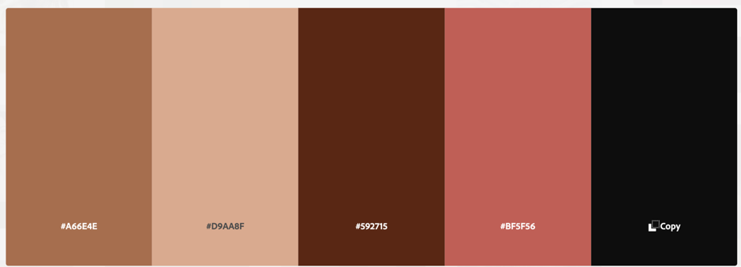

# **MMÁ**


MMÁ which means “Beauty” is an Irish hair supply shop that was launched successfully in Black History Month to celebrate and cater to the needs of the  Afro – Caribbean hair. 

The aim of MMA is to provide people with Afro- centric hair ,quality luxurious products that adds intensive hydration and softness to their hair which can be subjected to different harsh conditions every day. As well as provide suggestions for natural hairstyles that can be worn every day. 

The ecommerce store allows users to perform some basic operations such as purchasing products, adding reviews, and adding items to their wish list, with some limitations for unregistered users. The super user has access to all of the site's basic CRUD (Create, Read, Update, and Delete) functions related to products and reviews.

[View deployed site](https://mma-beauty.herokuapp.com/)

# **Table of Contents**   
1. [UX Development](#ux-development)
    * [PROJECT GOAL](#project-goal) 
        * [Business Goals](#business-goals)
      
    * [USER STORIES](#user-stories)
        * [New User](#new-user)
        * [Registered Users/Returning Users](#registered-user-or-returning-users)
        * [Admin User](#admin-user)
        * [Target Audience](#target-audience)

   * [RESEARCH](#research)

   * [DESIGN](#design)
        * [Colour Scheme](#colour-scheme)
        * [Typography](#typography)
        * [Imagery](#imagery)
        * [Wireframes](#wireframes)
        * [Database Structure](#database-structure)
        * [Other Tools](#other-tools)

      
2. [Features](#features)  
    * [EXISTING FEATURES](#existing-features) 
        * [General Features On All Pages](#general-features-on-all-pages)
        * [Features Of Each Page](#features-of-each-page)
        * [Features To Implement In Future](#features-to-implement-in-future)
      
3. [Technology Used](#technology-used)  
    * [Language Used](#language-used) 
    * [Frameworks & libraries](#frameworks-libraries)
    * [Packages/Dependencies Installed](#packages-dependencies-installed)
    * [Database Management](#database-management)
    * [Payment Service](#payment-service)
    * [Storage & Hosting](#storage-hosting)


4. [Testing](#testing)   
    * [TEST.md](#testing)   

5. [DEPLOYMENT](#deployment)
    * [How to Use Project](#how-to-use-project)
    * [Project Set Up](#project-set-up)
    * [Deployment To Heroku](#deployment-to-heroku)
    * [AWS And S3 Bucket Setup](#aws-and-s3-bucket-setup)
    * [Connect Django To AWS Bucket](#connect-django-to-aws-bucket)

7. [Credits](#credits)  
    * [Content](#content) 
    * [Media](#media)  
 
8. [Acknowledgements](#acknowledgements)  

<br/>   

# **UX Development**   

## **PROJECT GOAL**
The goal of MMÀ is to provide people with Afro Caribbean hair safe natural products that are not highly chemically processed and were designed for afro – textured hair. To demonstrate to others that there is beauty in our Afro-textured hair when properly cared for, and that we should be proud to wear it.

The site has been designed to be extremely user-friendly in order for the user to interact with the products and other features on the site( such as Login, purchase items , e.t.c). The administrator manages the site's information and products, which are regularly updated to ensure that our users receive the most up-to-date products and that the information is consistent across all pages. 

#### **Business Goals** 
As the site owner I want to :
1.	Create a visually appealing site that users are able to interact with and perform all the CRUD functions. 
2.	Create a highly intuitive website that promotes brand awareness and is user friendly.
3.	Be able to collect data from various users once they register/login to assist with more business informed decisions. 
4.	Attract new users to the site to  boost online traffic.

### **USER STORIES**
#### **NEW USER**
As a new/ unregistered user, I want to:
1.	Easily understand the purpose of the site and how it works 
2.	View all the recipes available with directions on how to prepare and cook the recipe. 
3.	Easily search for recipes and be able to view the full details of the recipe interested in.
4.	Easily locate the call to action buttons on the site to allow the user either register or Sign up .

#### **REGISTERED USER OR RETURNING USERS**
As a returning/ registered user, I want to:
1.	Easily Log In into my profile dashboard to explore recipes made by me.
2.	Easily search for recipes either by recipe name or the recipe category.
3.	Be able to create my own recipe and share on the site. Edit it’s content and delete if the case need be. 
4.	Easily edit my personal profile in case changes are needed. 
5.	Be able to order recipes online.

#### **ADMIN USER**
As an Admin User, I want to:
1.	Be able to do all the functionalities assigned to a registered user .
2.	Restrict access for certain features that can only be accessed by the admin 
3.	Add, Edit, or Delete the category of recipes present.
4.	Be able to edit , delete and update any recipes listed on the site.

#### **TARGET AUDIENCE**
- People looking to buy natural hair products for 3a, 3b, 3c, 4a, 4b, and 4c hair types. 
- Individuals looking for new natural hairstyles to wear on a daily basis 
- Individuals who want to learn more about Afro-textured hair products 
- People of colour aged 16 to 50.


### **RESEARCH**   
To get some UX inspiration for MMÀ-Beauty, I researched other afro-carribean hair care supply/beauty supply websites online, such as
1. [Carol's Daughter](https://www.carolsdaughter.com/)
2. [Aunt Jackie’s](https://shop.auntjackiescurlsandcoils.com/)
3. [SheaMoisture](https://www.sheamoisture.com/)
3. [Love Afro Cosmetics](https://www.loveafrocosmetics.com/)
4. [FitBeads](https://fitbeads.co/)
5. [Natural Wigs](https://naturalgirlwigs.com/products/afro-kinky-clip-ins)
6. [Toffieshop](https://www.toffieshop.com/)
7. [TheLipBar](https://thelipbar.com/)

To gain a design understanding of what these sites have in common and how MMÀ can improve their own products and services by addressing the issues associated with hair supply websites. 

According to research, there aren't many hair supply stores that cater to Afro-Caribbean hair in Europe, with a particular emphasis on Ireland. The afro Caribbean hair supply market is underserved in Europe, with only a few players.

Most Afro Caribbean hair products are sold in America and Africa, providing an opportunity for MMÀ to enter the European market and cater to the needs of our Afro Caribbean sisters who would love to have the right natural products for their hair locally.

MMÀ is a modern Afro hair care supply ecommerce store that was founded to meet the needs of Afro – Caribbean hair. The store specialises in providing users with genuine natural products that can help strengthen and restore the lusciousness of their hair. The site has been kept clean, with neutral colours that represent the skin tone of the underrepresented, in order for them to feel connected to the brand/for the brand to resonate with them.


## **DESIGN**   
### **Color Scheme**  
The colours used in the design of MM were obtained from the [Adobe Color website](https://color.adobe.com/search?q=recipe&t=term). The colours were inspired by the skin tone and hair of people of Black African descent in order to provide them with a sense of belonging and representation in order to build trust with our brand and stimulate their curiosity by using aesthetically pleasing images that catch our users' attention and provide a welcoming safe hair care environment. 

     

### **Typography**  
The [Google Fonts](https://fonts.google.com) Belleza and Source sans Pro were chosen for their delicate and feminine nature to give the site a friendly clean minimalist design. A backup font has also been included sans-serif.

### **Imagery**  
The photos on the site were obtained from [Carol's Daughter](https://www.carolsdaughter.com/), [Aunty Jackie's](https://shop.auntjackiescurlsandcoils.com/),[Loveafrocosmetics](https://www.loveafrocosmetics.com/africas-best-37-c.asp) , [Kiyo Beauty](https://www.kiyobeauty.com/), [NaturalCurly](https://naturalgirlwigs.com/products/afro-kinky-clip-ins) and [Sheamoisture](https://www.sheamoisture.com/).

Photoshop was used to create the brand logo as well as the background image on the homepage. 

The photographs show women proudly wearing their afro-textured hair, demonstrating to users that their natural hair can grow as long as western hair if properly cared for. The purpose of the images is to draw users' attention to our natural hair care website, where they can shop for and view natural hairstyles..

### **Wireframes**
The entire site's wireframe can be found below. This depicts the site on a desktop and a mobile device, with some tablet view wireframes indicating when the screen view differs.

* [Wireframe for Home Page](static/images/readme/homepage-wireframe.png)   
* [Wireframe for Recipes Page](static/images/readme/wireframe-recipes-page.png)   
* [Wireframe for Individual Single Recipe Page](static/images/readme/single-view-recipe.png)
* [Wireframe for Register Page](static/images/readme/register-wireframe.png)   
* [Wireframe for Profile with recipes](static/images/readme/profile-with-recipe-wireframe.png)
* [Wireframe for Profile without recipes](static/images/readme/profile-no-recipe-wireframe.png) 
* [Wireframe for Edit Profile](static/images/readme/edit-profile-wireframe.png)  
* [Wireframe for Add Recipe](static/images/readme/add-recipe-wireframe.png)   
* [Wireframe for Edit Recipe ](static/images/readme/edit-recipe-wireframe.png)
* [Wireframe for Manage Categories](static/images/readme/wireframe-for-managecategories.png)
* [Wireframe for Edit Category](static/images/readme/edit-category-wireframe.png)
* [Wireframe for Side Nav](static/images/readme/tablet-view.png)
* [Wireframe for View Each Category](static/images/readme/view-category-wireframe.png)
* [Wireframe for Delete Category](static/images/readme/delete-category-wireframe.png)
* [Wireframe for Tips & Tricks](static/images/readme/wireframe-for-tips-page.png)
* [Wireframe for Login](static/images/readme/login-page.png)


### **Database Structure** 
The database schema for MM was created using [Diagram.io](https://dbdiagram.io/home) and was derived from the app models. The screenshot shows the schema, which depicts the relationship between the apps. The user can only have one user profile and add items to their Wishlist. The available categories have a one-to-many relationship with the product.
  
 
These apps are 
-  **User** 
   - User model: This is built with Django allauth and contains the user's name, email address, and password.

- **Checkout App**   
   - Order model:  This contains the user's order information as well as their delivery information. 
   - OrderLineItem: This contains information about each product item that is related to a specific order.  
   
- **Product App**   
   - Product: This contains information about all of the products available at MMÀ.

   - Category: This section contains all of the product categories available at MMÀ.    

- **UserProfile App**   
   - User Profile: This is where the user's default delivery information is kept.

   - Category: This section contains all of the product categories available at MMÀ.    
 
- **Wishlist App**   
   - Wishlist: This contains the product that the user wishes to add to their Wishlist.

   - WishlistItem : This contains information about the products on the user's wishlist.    

- **ProductReview App**   
   - Product Review: This contains information about user reviews for specific products.
    
<br /> 
  
# **Features**  
## **Existing Features** 

### **GENERAL FEATURES ON ALL PAGES :**  
   - Each page is fully responsive on all pages and has been designed to be extremely user-friendly.

   - **Navigation Bar** - On all pages of Ayo Recipes, there is a fully responsive navigation bar. When the brand logo in the upper left corner is clicked, it takes the user to the homepage. The menu items on the left collapse to a hamburger icon when the width of the website is reduced to a smaller device, such as a mobile device. The user can easily click the icon to view Ayo Recipes' side nav bar and swipe left to hide it.
      * When a guest user visits the site, they will notice the following menu items at the top right: (Recipes, Create Recipes, Login, Register ) 
      * Members who are logged in can access the following menu items: (Recipes, Profile, Tips & Tricks, Logout), which allow them to create, edit, and delete recipes as well as receive discounts on kitchenwares.
      * When an admin user logs in, they see the same menu items as registered users, but there is an additional menu item that states "Manage categories.".

   - **Flash Messages** - When a user performs a basic CRUD function, flash messages appear on all pages to provide feedback on the action they performed. 

   - **Recipe Card containers** - Throughout the site, recipe card containers have been used to display the recipe image, name, and description in an orderly and appealing manner. The user can view more information about the recipes by clicking on the images in the card

   - **Footer** - The footer section contains Ayo Recipes' social media handles, where users can learn more about them in order to build trust with the brand and confirm business legitimacy. It also includes some additional links to cooking-related information.

   - **Defensive back-end programming** - There has been some back-end defensive programming to prevent users from accessing pages/functions that they are not permitted to access. For example, when a user views a single recipe, they cannot see the " ORDER NOW " button but can see the "BACK" button; however, if the user registers/logs in, they can see the "ORDER NOW" button if they are viewing a recipe that was not created by them.  

   - **Modal** - A modal appears on some pages for the user to perform the delete functionality.

### **FEATURES OF EACH PAGE**     

   - **Home Page**

      The hero image is located beneath the responsive navigation bar and serves to draw the user's attention. The header text has a zoom in effect that welcomes the user to the site, as well as a static tag line text that is visually appealing. 

      Under the header is a festive container with a brief summary of Ayo Recipes and three recipe containers with the highest star-rated recipes.

      The recipe containers allow the user to view the various categories of recipes available on the site. The user can view each recipe by clicking on any of the category names. 

      Following the categories section, the user can scroll down to see where they can buy cheaper kitchen decors that make cooking much easier. 
      <br/>

   - **Recipes Page**   
     * **Search Bar** : There is a search bar in the centre of the hero image header. The search bar allows the user to look up any recipe name or category.   
     * **Search Icon** : The search icon button allows the user to query their search, which leads to the results of the user's query 
     * **Clear Button** : The clear button resets the search query, allowing the user to return to the database's list of recipes rather than a search.  
     * **Recipe Cards** : In alphabetical order, the recipe cards display all of the recipes created by our registered users. The user can view more information about any of the recipes by clicking on them.  
     * **Back Button** : A back button is present at the bottom of the recipes page. This is placed before the footer to allow the user to return to the home page if they want to interact with another page.   
  
   <br/>

   - **Create Recipe/Login Page**
      - This displays a card form container with the following information: 
         * **Input Fields**: This enables the user to enter the information required to log into their account, such as (username and password). 
         * **Login Button** : To login to their profile, the user must complete all required fields, and once completed, it logs the user into their profile.
         * **Register Here Link** : If the user does not have an account with Ayo Recipes, there is a link under the card form container that redirects the user to the register page.
   
   <br/>

   - **Register Page**
      * A card container is also included, as are some mandatory input fields. The following inputs would be required from the user:
         - Full Name  
         - Username
         - Password 
         - Confirm Password
         - Phone Number 
         - Email
         - About yourself
      * **Sign Up Button** : All of the above fields must be filled out in order for the button to take the user to their profile once registered . 
      * **Log In Link** :If the user already has an account, there is a "LOGIN" link under the card container that takes them to the login page. 

   <br/>  

   - **Profile Page**
   
      * When a user logs in or registers with Ayo Recipes, they are taken to their profile page and greeted. 
      * **Header Image** : A header image containing the user's username is present in a card container at the top of the page.
      A profile container with the user's personal information is located beneath the header image. The information displayed on the profile is the information provided by the user when they registered.
      * **Buttons** :To perform any of their desired functions, the user can click on any of the buttons under the profile details: "CREATE A RECIPE" or "UPDATE A PROFILE."
      The user can view all of the recipes that have been created by clicking on the buttons. If no recipes are present, the user will see the message "No recipes added yet“.

   <br/>
 
   - **Edit Profile Page**
      * When a user logs in to their profile, they can access this page. When the user clicks on the "UPDATE PROFILE LINK," they will see the following pre-populated input fields.The input fields can be edited and must be filled out in order for the user profile to be updated. The fields are as follows:
         - Username
         - Phone Number
         - About me 
         - Email
     * **Buttons** : There are two buttons under the edit profile form that either update the profile or redirect the user back to the profile page.  

   <br/>

   - **Create A Recipe Page**  
     * When the user clicks the "CREATE A RECIPE" button, the user is taken to an add recipe form, which the user must complete. The following fields must be completed: 
       - Recipe Name 
       - Recipe Description 
       - Insert Ingredients
       - Recipe Directions
       - Recipe time
       - Recipe category 
       - Is vegetarian 
       - Recipe image_url : If the user has a link to the recipe image, they can enter it in the provided space.
       -	Recipe rating 

     * **Buttons** : The form includes two buttons under the input fields: "SUBMIT" and "CANCEL." When the submit button is pressed, the user's profile is updated with a new recipe, whereas when the cancel button is pressed, the user is redirected back to their profile page.  
     
   <br/>

   - **Single Recipe Page**  

      When a user clicks on one of the recipe cards, they are taken to a single recipe page that contains all of the information for the individual recipes. 

      When a guest user views this page, they will notice a "BACK" button in the middle of the page content, which will take them to the login page.

      When registered users view single recipes that were not created by them, they will notice the "ORDER NOW" button in the middle of the page, which will take them to another site where they can conveniently order the meal if they do not feel like preparing the recipe being viewed.

      For registered users  viewing recipes created by them they can see two action buttons at the middle of the page. The two buttons are “EDIT RECIPE” & “DELETE RECIPE” .When the user clicks on the delete recipe button a modal appears to ask the user if they are sure of their action. If yes , the user can delete the recipe and if no, the user can click cancel and return back to the single-recipe page .  

      The admin user has access to all of the buttons that are available to registered users who have created recipes. The admin user has the ability to edit and delete recipes created by registered users as well as create new recipes.

      * **Back Button** : Under the single recipe content, there is a back button that allows the user to return to the recipes page.
   
   <br/>

   - **Edit Recipe Page** 

      * When a user clicks the "EDIT RECIPE" button, they are taken to the edit recipe page, which contains pre-populated input fields for the previously created recipes. Some of the pre-populated input fields, such as the following , can be edited.
         - Recipe Name 
         - Recipe Description 
         - Insert Ingredients
         - Recipe Directions
         - Recipe time
         - Recipe category 
         - Is vegetarian 
         - Recipe image_url : The user can update their recipe image

      * **Button** : Once the fields have been correctly filled out, the user can click on either the "EDIT RECIPE" or "CANCEL" buttons. When the "EDIT RECIPE" button is clicked, the recipe information is updated, and when the "CANCEL" button is clicked, the user is returned to the single recipe page.
    
   <br/> 

   - **Tips & Tricks Page**
      Tips & Tricks Page This page provides the user with everyday kitchen hacks that can be used to make the cooking process as simple as possible. The tips aspect has been divided into three sections, each with a brief summary of how the user can deal with the situation. Providing users with discount codes that can be used to purchase a variety of kitchenware hack items.
    
<br/>

   - **View Category Page**(Admin)  
     When a guest or registered user visits Ayo Recipes and navigates to the 'Browse our categories' section, they can click on the images or category names to view all of the recipes in that category.

      When a user visits the page, a header image with the Category name and a brief description of the category appears.

      If there are recipes in the category clicked, the user can see the recipe cards below the header image, but if there are none, the user sees the message "No category results found."

     * **Button** : There is a back button at the bottom of the recipe card that, when clicked, takes the user back to the home page.  
   
   <br/>

   - **Manage Categories** (only available to admin)  
     This page is only accessible to the site's Admin user. When an administrator logs in, they will notice the "MANAGE CATEGORY" option among the menu line items. 

      When the user clicks, they can see all of the categories that are currently available in our recipe database, which is represented by a card container. The category name and two buttons are included in the card container. The admin user can either "EDIT" or "DELETE" the category using the buttons. 

   <br/>

   - **Add Category Page** (only available to admin)  
     There is a 'ADD CATEGORY " button at the bottom of the manage category page that allows the admin to add new categories for the users. This takes the admin user to a new page where they must enter the following information:
       - A category Name
       -	Category description
   
      Before the admin user can add the category, these fields must be correctly filled out. If the admin user fills out the form correctly, he or she can click the "ADD CATEGORY" button, and the category will be added and the admin user will be redirected back to the manage category page.

      If the admin user does not want to add a new category, they can simply click the "BACK" button to return to the manage category page.

   <br/>

   - **Edit Category Page** (only available to admin)  
     The admin can change the category by clicking the "EDIT" button on the manage category page. When the button is pressed, the user is taken to the edit -category page, which contains a pre-populated form with the category name and description. 

      The admin user can update the pre-populated data, and once the fields are properly filled, the user can click the "Update category" button to update the data and return to the manage category page. If the user changes their mind after editing the category information, they can return to the manage category page by clicking the other button "CANCEL.

   <br/>

   - **Delete Category Page** (only available to admin)  
     To delete a category, the user can simply click the "DELETE" button on the manage category page. When the admin user clicks this button, a modal appears asking the user to confirm their action.  The user can delete the category name and description from the manage - category dashboard by clicking the delete button. If the answer is no, the user can cancel and return to the manage-category page.

   <br/>  

### **FEATURES TO IMPLEMENT IN FUTURE**  

1. Forgot password functionality: This would allow users to change their passwords if they forgot them without having to create a new account each time they forgot their password. 

2. Pagination : As the number of recipes in the database grows, pagination should be added to the recipes and view category pages for a better user experience. 

3. A save recipe function that allows registered users to save recipes created by other members to their profile would be ideal. The saved recipes would appear on the registered user's profile alongside recipes created by them.

4. Profile picture: When a user creates an account, there should be a dropdown of images from which the user can choose an Ayo Recipes profile image. When the image is selected and the user is logged in, the profile image and the user's name should appear at the top of the profile page.

5.  The admin user should be given more powers, such as the ability to manage user information by editing or deleting it.

6. A public profile page where registered users can view information about other members as well as recipes they've created. Users should be able to leave reviews on each other's profile pages if any of the recipes they created have been attempted.

7. An e-cart that allows users to order recipes directly from the page rather than through a third-party link. On their profile page, registered users can post recipes and sell food items.

<br/>   
  
# **TECHNOLOGY USED**
### **LANGUAGE USED** 
   * [HTML5](https://en.wikipedia.org/wiki/HTML5)   
   * [CSS3](https://en.wikipedia.org/wiki/Cascading_Style_Sheets)   
   * [JavaScript](https://en.wikipedia.org/wiki/JavaScript)   
   * [Python](https://en.wikipedia.org/wiki/Python_(programming_language))   

### **FRAMEWORKS & LIBRARIES**   
   * [Django Template](https://jinja.palletsprojects.com) : Django used this as a templating language to display backend data on the frontend.

   * [BOOTSTRAP 4.0](https://getbootstrap.com/docs/4.0/):  This was used to help with the website's structure, style, and responsiveness across all devices.

   * [jQuery 3.6.0](https://jquery.com/) : This is a JavaScript library that makes it possible to write less JavaScript code.

   * [Fontawesome](https://fontawesome.com/) : This was used to convey information using icons and to improve the site's appearance.

   * [Google Fonts](https://fonts.google.com/) : For this project's design, the fonts Belleza and Source Sans Pro have been imported into the stylesheet.

   * [GITHUB](https://github.com/) : This was the location of the project's code.


### **PACKAGES/ DEPENDENCIES INSTALLED** 
   * [Django Countries](https://pypi.org/project/django-countries/) : This was used to provide form country options as well as a model country field.

   * [Django Allauth](https://django-allauth.readthedocs.io/en/latest/) : This was used to verify users' identities, register them, and manage their accounts.  

   * [Django Crispy Form](https://django-crispy-forms.readthedocs.io/en/latest/) : This was used to manage forms on the website, allowing us to modify their properties.

   * [Gunicorn](https://gunicorn.org/) : This is an HTTP server for WSGI applications that will be used to aid in the deployment of the project.

   * [Pillow](https://pypi.org/project/Pillow/) : This is a Python imaging library for processing and manipulating images.

### **DATABASE MANAGEMENT**

   * [SQLite](https://www.sqlite.com/index.html) : This served as our database for development.  

   * [Heroku Postgres](https://www.heroku.com/postgres) :  This was used for our Heroku database in production.  

### **PAYMENT SERVICE** 
   * [Stripe]https://dashboard.stripe.com/): This was used to process payments on the website. 

### **STORAGE & HOSTING**  
   * [Amazon Web Service S3](https://aws.amazon.com/s3/) :This was used in production to host all of our static and media files.

   * [Heroku](https://en.wikipedia.org/wiki/Heroku) : This was our preferred cloud platform for deploying our project.

   * [GITHUB](https://github.com/) : This was our preferred cloud platform for deploying our project.

### **OTHER TOOLS**  

   * [FIGMA](https://www.figma.com/) : This was used to create wireframes for MMÀ-HAIRCARE (mobile, ipad and desktop devices).

   * [GIT](https://git-scm.com/) : This was the preferred method of version control. To commit and publish our project to GitHub, we used the gitpod.

   * [Favicon.io](https://favicon.io/favicon-converter/) : This is a Favicon maker that was used to create the MMÀ-HAIRCARE favicon. 

   * [JSHint](https://jshint.com/) : This was used to analyse the JavaScript code and ensure that all errors were minimised. 

   * [PEP8](http://pep8online.com/) : This was used to run our Python code to ensure it was free of errors.

   * [CHROME DEV TOOLS]() : This was used to test the responsiveness of our website across different screen sizes.

   * [dbdiagram.io](dbdiagram.io) : This was used to create the MMÀ- HAIRCARE database schema. 

   * [Adobe Color](https://color.adobe.com/): This was used to select the site's colour scheme.

   * [TinyPNG](https://tinyjpg.com/): This is an image compressor that is used to compress all images.


# **Testing**  
The testing documentation can be found [here](). 

<br/>   
  
# **DEPLOYMENT**   
This project was created with Gitpod as the IDE, committed to git as its local repository, and is hosted on Github because Github Pages cannot host Python projects. The project is deployed using a free hosting service (Heroku), and the static and media files are stored in AWS S3.

To Deploy MMÁ the following are needed 
   -	A Heroku account  
   -	An AWS Account 
   -	A github account 


### **How To Use Project**   
In the event that a user wishes to fork the project or clone the project, the necessary steps are also provided below.

#### **Forking the repository**  
By forking the GitHub repository, you can create a copy of the original repository on your GitHub account to view and/or make changes to without affecting the original repository, as shown below: 

1. Sign in to your GitHub account.  
2. Locate the repository to be duplicated, in this case MMÁ – Haircare.  
3. Locate and click the “Fork” button at the top of the  MMÁ – Haircare repository page. 
4. This creates a copy of the repository in our account and allows us to make changes.

#### **Making A Local Clone og Github Repository**   

1. Please sign in to your GitHub account. 
2. Locate the desired repository in this case  MMÁ – Haircare.

3.	Locate the “Code” button at the top of the MMÁ – Haircare repository page. Click it and copy the HTTPS link that appears.

4.	Activate your local IDE terminal.

5.	Change the current working directory to the location where you wish the cloned file to be saved.

6.	In the terminal, type “git clone” and then paste the link copied from HTTPS.  
```$ git clone https://github.com/YOUR-USERNAME/YOUR-REPOSITORY```

7. Press Enter and  your local clone is created.

8. Create a new env.py file in the base directory and include the following code.
```
import os
#Django
os.environ.setdefault( 'DEVELOPMENT', 'True')
os.environ.setdefault('SECRET_KEY', '<YOUR_KEY>')

#Stripe
os.environ.setdefault('STRIPE_PUBLIC_KEY', '<YOUR_KEY>')
os.environ.setdefault('STRIPE_SECRET_KEY', '<YOUR_KEY>')
os.environ.setdefault('STRIPE_WH_SECRET', '<YOUR_KEY>')
```
9. Ensure that the env.py file is located in the .gitignore file.

10. Type the following into the terminal to install our required dependencies and modules.
```pip3 install -r requirements.txt```

11. To create our first database, enter the following commands into the terminal.
```
python3 manage.py makemigrations 
python3 manage.py migrate 
``` 

12. Create a super user : 
``` python3 manage.py create superuser ```

13. To run our site locally type the following to the CLI : 
``` python3 manage.py runserver ```

#### **Project Set Up** 
After forking or cloning the MMÀ-HAIRCARE repository, the following steps must be completed in order for our github repository to be deployed to Heroku.
1.  Ensure that all MMÀ- Haircare dependencies are installed and operational. The gitignore file contains all of the necessary hidden files.

2. Go to your gitpod workspace after installing the necessary dependencies. Variables can be found under Settings - --> Variables. Enter the following project environment variables:
   Varables | Key   
   ---| ---   
   DEVELOPMENT | TRUE   
   SECRET_KEY | <your_secret_key>  
   STRIPE_PUBLIC_KEY | <your_secret_key>  
   STRIPE_SECRET_KEY | <your_secret_key>   
   STRIPE_WH_KEY | <your_secret_key>

   These keys can be obtained from  
      -	The SECRET_KEY from [Django Secret Key Generator](https://miniwebtool.com/django-secret-key-generator/) 
      -	By creating an account, you can obtain the STRIPE PUBLIC KEY and STRIPE SECRET KEY. This is located in the 'Developers' section (API KEY). 
      - The STRIPE WH KEY can be obtained from the 'Webhooks' section of the 'Developers' section. After you've navigated to 'Webhooks,' click "Add new endpoint." Insert your endpoint URL here ``` https://<your_host_url>/checkout/wh/. ``` 
      To listen to events, select payment.intent.success and payment.intent.failed, and then create an endpoint. STRIPE WH KEY can be revealed once it has been created.

3. Make migrations to keep our database up to date.

4. We can now run the server and deploy after it has been updated.

### **Deployment To Heroku**

1. Create a new Heroku App
   - Sign in or create a Heroku account. After logging in, click "Create new app" in the top right corner of your dashboard.

   - Give your app a unique name and use a hyphen between words.

   - Select a region near you and then click Create App.

2. Navigate to the resources tab on the app dashboard, search for "Heroku Postgres" under Add-ons, select it, and then select the free plan.

3. On Heroku's Dashboard, Under settings, click the "Reveal Configure vars" button and enter the required configuration variables, including those whose values may not yet be present. The unavailable values would be updated as you progress through the steps.
      Varables | Key   
      ---| ---   
      AWS_ACCESS_KEY_ID | your access aws key 
      AWS_SECRET_ACCESS_KEY| Your secret access aws key  
      DATABASE_URL| Your database url   
      EMAIL_HOST_PASS | Your app password
      EMAIL_HOST_USER | Your email address  
      SECRET_KEY | Your secret key
      STRIPE_PUBLIC_KEY | Your stripe public key 
      STRIPE_SECRET_KEY | Your stripe secret key
      USE_AWS | True

4. Return to your project's Gitpod IDE and use the CLI to install the following important files: 
   ```
   pip3 install dj_database_url
   pip3 install psycopg2-binary
   ```
   - Once the requirements have been created, we must freeze them in our CLI pip3 freeze > requirements.txt to ensure that Heroku instals our app when it is deployed.

   - Create a new database for MMÀ- Haircare by importing dj database url into our settings.py file and commenting out our default configuration. We would need to replace the default database with a call to dj database url.parse and pass it the database URL from Heroku (which can be found in our app settings tab's config variables).
      ```
      DATABASES = {
      'default': dj_database_url.parse('YOUR_DATABASE_URL_FROM_HEROKU')
      }
      ```
   - Run migrations
      ```
      python3 manage.py migrate
      ```
5. To load our product data from the fixtures folder to our deployed MMÀ site, we must first load the category data before the product data because the products rely on the existing category.
   ```
   python3 manage.py loaddata categories
   python3 manage.py loaddata products
   ```

6. Create a new super user to log in with and provide details for the username and password.
   ```
   python3 manage.py create superuser
   ```

7. Remove the Heroku database URL from our settings.py file and uncomment the default database configuration. Add an if statement to specify that if the app is running on Heroku, it should connect to Postgres; otherwise, it should connect to Sqlite.

```
   if 'DATABASE_URL' in os.environ:
      DATABASES = {
         'default': dj_database_url.parse(os.environ.get('DATABASE_URL'))
      }
   else:
      DATABASES = {
         'default': {
            'ENGINE': 'django.db.backends.sqlite3',
            'NAME': BASE_DIR / 'db.sqlite3',
         }
      }
   ```  

8. Once we've created our conditional statement, we'll need to install Gunicorn, which will serve as our webserver.  
   ```
   pip3 install gunicorn 
   ```

9. Freeze our requirements after installation to ensure that all of our app's required packages are installed.
   ```
   pip3 freeze > requirements.txt 
   ```

10. Create a Procfile that instructs Heroku to create a web dyno that will run gunicorn and our app.
   ```
   web: gunicorn mma.wsgi:application 
   ```
11. Log in to Heroku via the CLI and temporarily disable collectstatic so that Heroku does not attempt to collectstatic files when it deploys.
   ```
   heroku config:set DISABLE_COLLECTSTATIC=1 --app mma-beauty
   ```

12. After we have completed the preceding steps, we must add the hostname of our Heroku app (MMÀ-beauty) to the list of allowed hosts in our settings. py and also include localhost so that Gitpod can continue to function:
   ```
   ALLOWED_HOSTS = [‘mma-beauty.herokuapp.com’, 'localhost']
   ```

13. Save all files, commit, and push to github, then Heroku. We would need to initialise git remote because we created our app via the heroku  website rather than the terminal.
   ```
   heroku git:remote -a mma-beauty 
   ```
   and then push to Heroku using 
   ```
   git push heroku main 
   ```

14. Link our Git repository to Heroku
   - Return to the Heroku Dashboard and select "deploy" at the top.

   - Choose "GitHub" as the deployment method from the section.

   - This provides you with an input field in which you can search for your GitHub repository by name. When you find the correct repository, in our case "MMÀ – HAIRCARE," click "Connect."

   - To ensure that all configuration variables on Heroku are updated with the required values, click the "Reveal Config Vars" button.


15. Enable Automatic Deployment

   - Once we've configured all of our environment variables, return to the dashboard and click "Deploy." Scroll down to "Automatic Deployments" and press the "Enable Automatic Deployment" button.

   - When we push to github, Heroku will automatically build our app with all of the required packages. Go to the top right corner and select "Open App" to view the website.

16. Return to our MMÀ-settings.py file and replace the secret key setting with the call to get it from the environment, with an empty string as the default.
``` SECRET_KEY = os.environ.get('SECRET_KEY', '') ```

   Then, set debug to true only if the environment contains a variable called development.

   ``` DEBUG = 'DEVELOPMENT' in os.environ ```


### **AWS AND S3 BUCKET SETUP**

Amazon web services s3 is a cloud-based storage service where we would store our static files and images.

1. Go to aws.amazon.com and sign up for an AWS account.

2. Log in to your account, go to the AWS management console, and then search for s3 to access its dashboard.
   - Click the "Create new bucket" button. It is preferable if you provide a bucket name that is the same as your app name. Then choose a region near you.

   - Select ACLS enabled and Bucket Owner Preferenced in the 'Object Ownership' section.

   - Uncheck the "block all public access" box and check the "I acknowledge that the current settings may result in this bucket and its contents becoming public" box.

   - Uncheck the "block all public access" box and check the "I acknowledge that the current settings may result in this bucket and its contents becoming public" box.

3. To configure our bucket, click on the newly created bucket. Select the "properties tab." Scroll down to the "Static Website Hosting" section at the bottom of the page. When you've found it, click edit and then enable.Set the 
   -	Hosting type: choose Host a Static Website
   -	Index document: index.html
   -	Error document: error.html and then Save Changes

4.  Scroll down to find Cross-origin resource sharing (CORS) on the permissions tab. Click edit and paste our CORS configuration to establish the necessary access between our Heroku app and this S3 bucket. Once copied, save the changes.
   ```
      [
         {
            "AllowedHeaders": [
               "Authorization"
            ],
            "AllowedMethods": [
               "GET"
            ],
            "AllowedOrigins": [
               "*"
            ],
            "ExposeHeaders": []
         }
      ]
   ``` 
   To create a security policy for this bucket, go to "bucket policy" and select "policy generator" while still on the permissions tab.
      - Select Type of Policy: choose S3 Bucket Policy
      - Effect: choose Allow
      - Principal: *
      - Actions: select GetObject
      - Retrieve the Amazon Resource Name (ARN) from the Bucket ARN, which can be found in the "Bucket Policy" section.
      - Select "Add Statement," then "Generate Policy." Copy and paste the policy into the bucket policy editor.
      - To allow access to all resources in the new bucket, however, we must add a slash star at the end of the resource key. Then click the Save button. This is how the resource key should look.
      ``` "Resource": "arn:aws:s3:::YOUR_BUCKET_NAME/*" ```
      - Still on the permissions tab, navigate to the "Access Control List (ACL)" section, click Edit, and then enable List for Everyone (public access), and accept the warning box.


#### **IAM SETUP**

1. To access the dashboard, navigate to the AWS management console and search for 'IAM,' which stands for Identity and Access Management.

2. Create a user group by selecting "User Groups" from the sidebar and clicking "Create New Group," then providing a name related to your application.

3. Create a group for the user by selecting "User Groups" from the sidebar and clicking "Create New Group," then providing a name related to your application.
   - Look for s3 and then import "Amazon s3 full access policy.
   - To grant full access to our bucket in the policy, copy the ARN from the "bucket policy" page in S3, and our JSON editor should look like this.

   {
    "Version": "2012-10-17",
    "Statement": [
        {
            "Effect": "Allow",
            "Action": [
                "s3:*"
            ],
            "Resource": [
                "arn:aws:s3:::<YOUR-ARN>",
                "arn:aws:s3:::<YOUR-ARN>/*"
            ]
        }
    ]
   }

   - Click on the next page, which contains tags that are not required but must be clicked in order to access the "review policy page."

   - On the policy review page, enter a name and a description, then click "Create Policy." The policy is now in place.

4. To add the user to a newly created group so that the user can access its policy.
   - We begin by attaching the policy to the group by clicking on "User Groups" and then selecting the previously created group.

   - To add a user to that group, Click "User" in the sidenav bar and then "Add Users."

   - To add a user to that group, Click "User" in the sidenav bar and then "Add Users."

   - Make a username, grant programmatic access, and then click "Next:Permissions."

   - Check for the group that has our policy attached, select it, and then click "Next:Tags," "Next:Review No Need for Changes," and finally "Create User."

   - Download the CSV file containing the user's access key and the secret access key required for deployment in our Heroku app.


### **CONNECT DJANGO TO AWS BUCKET**
To connect Django to our S3 bucket, we must first perform the following steps:

1. Boto3 and django-storages are two new packages to install. Freeze the new packages in our requirements.txt file.
   ```
   pip3 install boto3
   pip3 install django-storages
   pip3 freeze > requirements.txt
   ```
2. Add storages to the installed Apps in  our MMÀ- Haircare settings.py.

3. To connect our s3 bucket in MMÀ- Haircare settings.py, we need to include an if statement that states:
   ```
   if 'USE_AWS' in os.environ:
    # Cache control
    AWS_S3_OBJECT_PARAMETERS = {
        'Expires': 'Thu, 31 Dec 2099 20:00:00 GMT',
        'CacheControl': 'max-age=94608000',
    }
    
    # Bucket Config
    AWS_STORAGE_BUCKET_NAME = 'jiira'
    AWS_S3_REGION_NAME = 'eu-west-2'
    AWS_ACCESS_KEY_ID = os.environ.get('AWS_ACCESS_KEY_ID')
    AWS_SECRET_ACCESS_KEY = os.environ.get('AWS_SECRET_ACCESS_KEY')
    AWS_S3_CUSTOM_DOMAIN = f'{AWS_STORAGE_BUCKET_NAME}.s3.amazonaws.com'

    # Static and media files
    STATICFILES_STORAGE = 'custom_storages.StaticStorage'
    STATICFILES_LOCATION = 'static'
    DEFAULT_FILE_STORAGE = 'custom_storages.MediaStorage'
    MEDIAFILES_LOCATION = 'media'

    # Override static and media URLs in production
    STATIC_URL = f'https://{AWS_S3_CUSTOM_DOMAIN}/{STATICFILES_LOCATION}/'
    MEDIA_URL = f'https://{AWS_S3_CUSTOM_DOMAIN}/{MEDIAFILES_LOCATION}/'
   ```

4. Once those settings are in place, return to Heroku settings and include the following information from our AWS policy in "Reveal Config Vars."

   Variables | Value
   --- | ---
   AWS_ACCESS_KEY_ID | access key id from aws csv file
   AWS_SECRET_ACCESS_KEY | your secret access key from aws csv file
   USE_AWS | True

5. Remove the variable "DISABLE COLLECTSTATIC" from Reveal Config Vars.

6. Return to your Gitpod IDE and create a file called "custom storages.py" to tell Django that in production, we need to use S3 to store our static files and images whenever collectstatic is run. Included in that file are the following:
   ```
   from django.conf import settings
   from storages.backends.s3boto3 import S3Boto3Storage
 

   class StaticStorage(S3Boto3Storage):
      location = settings.STATICFILES_LOCATION


   class MediaStorage(S3Boto3Storage):
      location = settings.MEDIAFILES_LOCATION
   ``` 

7. Push all changes to github to ensure that everything listed above is properly installed.


We can now create our database after we have set up MongoDB. The database was built using the Ayo Recipes [Data Scheme](static/images/readme/database-schema.png "Database schema").    

2. **Create database**    
   * Select the Cluster tab, then select the "Collections" button.  
   * Since we aren’t uploading an existing dataset, select "Create Database."  
   * Provide the name of your database and one initial collection that will be used for your project. 
   * After we've done that, we can add more collections to our database by clicking the "Create Collection" button.
   * We can manually create a document by selecting one of the collections and clicking the "insert document" button in the upper right corner. 

### **2. Fork or Clone The Github Repository**   

#### **Forking The GitHub Repository**  
By forking the GitHub repository, we create a clone of our original repository (AYO RECIPES) in our GitHub account. By cloning our project we can make  modifications and experiments on the cloned repository without affecting the original repository.   

1. Sign In to GitHub account .  
2. Decide from the list of repositories which you would want to be duplicated. For this project it's AYO RECIPES .  
3. Locate the "fork" option at the top right corner of the AYO RECIPES and click it. Once clicked it creates another copy of the AYO RECIPES repository to accommodate modifications.  

#### **Making A Local Clone**     
1. Log in to your GitHub account.
2. Locate the desired repository to clone which in this case is “AYO RECIPES” .
3. At the top of AYO RECIPES repository page,  Locate the “Code” button at the top  and click it. Copy the HTTPS link that appears.
4. Activate your local IDE terminal.
5. In the terminal, type “git clone” and then paste the link copied from HTTPS.
```
$ git clone https://github.com/YOUR-USERNAME/YOUR-REPOSITORY
```
6. Press “Enter” and your local clone has been created.


# **Credits**  
### **CONTENT**  
1. The design of the site was inspired by research on black beauty websites such as [LipBar](https://thelipbar.com/), [Loveafrocosmetics](https://www.loveafrocosmetics.com/africas-best-37-c.asp) , [Kiyo Beauty](https://www.kiyobeauty.com/) and [BlackBeautyCosmetics](https://blackbeautybombshells.com/40-actual-4c-natural-hair-hairstyles/)

2. The code from Code Institute's "Boutique Ado" Full stack framework with Django was primarily used as a reference and guide for developing the MMÀ ecommerce store using the following: HTML, CSS, JS, Python+Django, PostgreSQL database, Stripe, and AWS S3 as storage.

3. Photoshop was used to resize and edit the images that appear throughout the site.
      
4. The animation effect used on the about page text header was obtained from the [CSS tricks](https://css-tricks.com/almanac/properties/a/animation/)  website. 

5. The external links on the about page relating to haircare tips and afro styles were obtained from [Black Beauty Bombshell](https://blackbeautybombshells.com/40-actual-4c-natural-hair-hairstyles/) and [BlackHairInformation](https://blackhairinformation.com/by-type/natural-hair/7-tips-managing-multiple-textures-natural-hair/). 

6. Majority of the products information added to MMÀ-HAIIRCARE database were from hair supply websites such as [Carol's Daughter](https://www.carolsdaughter.com/), [Aunty Jackie's](https://shop.auntjackiescurlsandcoils.com/), [NaturalCurly](https://naturalgirlwigs.com/products/afro-kinky-clip-ins) and [Sheamoisture](https://www.sheamoisture.com/). 

7. This readme was based on research on several readme documents, including the Code Institute's readme [sample](https://github.com/Code-Institute-Solutions/SampleREADME), Shoe's and More readMe [sample](https://github.com/dissyulina/), Jira's readMe [sample](https://github.com/johnroutledge/milestone-project-4), FLYBODY's readMe [file](https://github.com/Didisimmons/Flybody-gym) and Ayo Recipe's readME [file](https://github.com/Didisimmons/Ayo-Recipes#deployment). 

8. The quote used on the product page was obtained from [Trace Ellis Ross](https://www.stylerave.com/wp-content/uploads/2020/06/fullsizeoutput_2832.jpeg)

 
### **MEDIA**   
* The majority of the images on the website were obtained from hair supply websites such as [Carol's Daughter](https://www.carolsdaughter.com/), [Aunty Jackie's](https://shop.auntjackiescurlsandcoils.com/), [Sheamoisture](https://www.sheamoisture.com/) and [NaturalCurly](https://naturalgirlwigs.com/products/afro-kinky-clip-ins)

* The homepage's hero image was obtained from Efik Zara's [Youtube](https://unsplash.com/photos/of0pMsWApZE) account and edited with Photoshop.

* Photoshop was used to create the image for the site's brand logo.

* [Black Beauty Bombshells](https://blackbeautybombshells.com/40-actual-4c-natural-hair-hairstyles/) provided the images for the about page and Photoshop was used to edit.

<br/> 

# **Acknowledgements**   
   * I'd like to express my gratitude to my mentor, Sammy Dartnall, for her constant encouragement and constructive feedback on this project. 
   * I'd like to thank the Slack community as a valuable resource for their constant support and assistance with any issues that arose.
   * The tutor support team for their assistance and helpful problem-solving guidelines.
<br/> 

[Back to top &uarr;](#mma)  