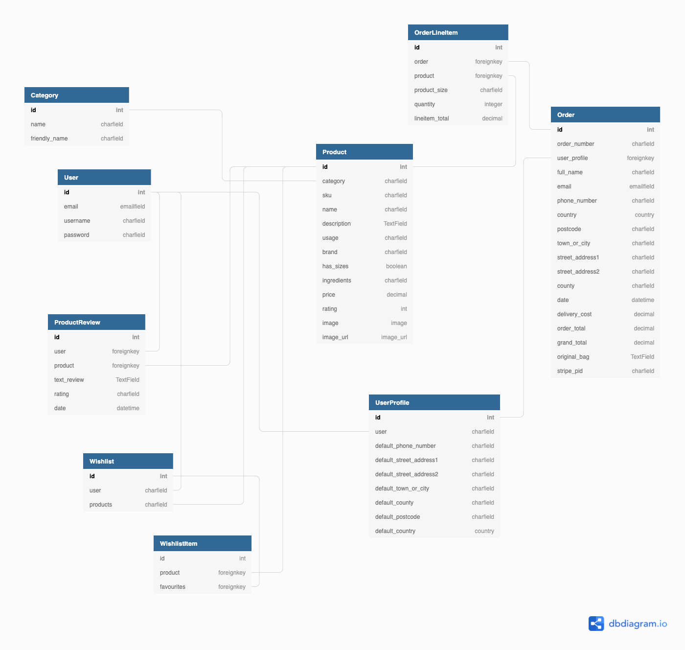
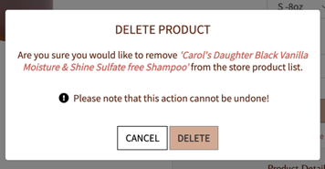

# **MMÁ**


MMÁ which means “Beauty” is an Irish hair supply shop that was launched successfully in Black History Month to celebrate and cater to the needs of the  Afro – Caribbean hair. 

The aim of MMA is to provide people with Afro- centric hair ,quality luxurious products that adds intensive hydration and softness to their hair which can be subjected to different harsh conditions every day. As well as provide suggestions for natural hairstyles that can be worn every day. 

The ecommerce store allows users to perform some basic operations such as purchasing products, adding reviews, and adding items to their wish list, with some limitations for unregistered users. The super user has access to all of the site's basic CRUD (Create, Read, Update, and Delete) functions related to products and reviews.

[View deployed site](https://mma-beauty.herokuapp.com/)

# **Table of Contents**   
1. [UX Development](#ux-development)
    * [PROJECT GOAL](#project-goal) 
        * [Business Goals](#business-goals)
      
    * [USER STORIES](#user-stories)
        * [New User](#new-user)
        * [Registered Users/Returning Users](#registered-user-or-returning-users)
        * [Admin User](#admin-user)
        * [Target Audience](#target-audience)

   * [RESEARCH](#research)

   * [DESIGN](#design)
        * [Colour Scheme](#colour-scheme)
        * [Typography](#typography)
        * [Imagery](#imagery)
        * [Wireframes](#wireframes)
        * [Database Structure](#database-structure)
        * [Other Tools](#other-tools)

      
2. [Features](#features)  
    * [EXISTING FEATURES](#existing-features) 
        * [General Features On All Pages](#general-features-on-all-pages)
        * [Features Of Each Page](#features-of-each-page)
        * [Features To Implement In Future](#features-to-implement-in-future)
      
3. [Technology Used](#technology-used)  
    * [Language Used](#language-used) 
    * [Frameworks & libraries](#frameworks-libraries)
    * [Packages/Dependencies Installed](#packages-dependencies-installed)
    * [Database Management](#database-management)
    * [Payment Service](#payment-service)
    * [Storage & Hosting](#storage-hosting)


4. [Testing](#testing)   
    * [TEST.md](#testing)   

5. [DEPLOYMENT](#deployment)
    * [How to Use Project](#how-to-use-project)
    * [Project Set Up](#project-set-up)
    * [Deployment To Heroku](#deployment-to-heroku)
    * [AWS And S3 Bucket Setup](#aws-and-s3-bucket-setup)
    * [Connect Django To AWS Bucket](#connect-django-to-aws-bucket)

7. [Credits](#credits)  
    * [Content](#content) 
    * [Media](#media)  
 
8. [Acknowledgements](#acknowledgements)  

<br/>   

# **UX Development**   

## **PROJECT GOAL**
The goal of MMÀ is to provide people with Afro Caribbean hair safe natural products that are not highly chemically processed and were designed for afro – textured hair. To demonstrate to others that there is beauty in our Afro-textured hair when properly cared for, and that we should be proud to wear it.

The site has been designed to be extremely user-friendly in order for the user to interact with the products and other features on the site( such as Login, purchase items , e.t.c). The administrator manages the site's information and products, which are regularly updated to ensure that our users receive the most up-to-date products and that the information is consistent across all pages. 

#### **Business Goals** 
As the site owner I want to :
1.	Create a visually appealing site that is responsive on all devices, promotes brand awareness, and is easy to use . 
2.	Be able to manage the site (add, modify, and delete products).
3.	Prevent fraudulent activities by ensuring  that a secure payment system for the user is implemented on the site.
4.	Attract new users to the site to boost online traffic.

### **USER STORIES**
#### **NEW USER**
As a new/ unregistered shopper, I want to:
1. Quickly grasp the  purpose of the site. 
2.	Navigate the site easily to explore all of the site's features, such as product search. 
3.	View all of the products available on the site and be able to view each product individually to learn more about it. 
4.	Navigate the menu items to find products in various categories and other sections of the website.  
5.	Be able to sort products by price, brand or rating.
6.	Be able to add items to my shopping bag for purchase. 
7.	Be able to view my shopping bag with products for purchase. 
8.	View the total of my shopping cart at any time on the site to ensure I am not spending more than I intended.
9.	Easily checkout as a guest user without having to create an account, and receive an order confirmation once I have completed your purchase.. 
10. Be able to read product reviews for products. 
11. Join their community to stay up to date on afro textured hair products and information.. 
12. Be able to find information about their return policies, FAQs, shipping and returns, and so on.
13. Receive an email confirming my purchase. 
14. Perform functions such as adding items to cart, editing the shopping cart, or deleting an item from the shopping cart, I would like to receive real-time useful feedback..
15. Be able to personalise my shopping experience, I should be able to sign up on the website and save my information in my profile for future purchases.
16. Locate the website's social media handles quickly to confirm their authenticity and build trust in the brand.
17. Be  able to enter my payment information without difficulty during checkout, and the payment system is secure and safe. 


#### **REGISTERED USER OR RETURNING USERS**
As a returning/ registered shopper, I want to:
1.	Be able to access all of the functionalities that an unregistered user/shopper can.
2.	Receive an email confirming the creation of my account after. registering. 
3.	Easily Log in to my profile dashboard to view personal information like my default address and order history.
4.	Easily Log out from my profile. 
5.	Be able to recover my password if I forget it, to access my profile.
6.	Be able to easily add product items to my Wishlist while browsing the website's products.
7.	Be able to view my wishlist items and delete them when they're no longer needed.
8.	Be able to add reviews for products purchased.
9.	Be able to edit a review that has already been posted for a product in order to update its content.
10. Be provided with real-time useful feedback when I perform functions such as adding a review, adding items to a wishlist, deleting items from a wishlist, and so on.Be able to update  my personal information such as default delivery address in my profile 


#### **ADMIN USER**
As an Admin User, I want to:
1.	Be able to perform all of the functions assigned to a registered user
2.	Restrict access to certain features, such as product management (add, edit, and delete products) and review deleting.
3.	Be able to access the admin portal in order to view all orders and users.


#### **TARGET AUDIENCE**
- People looking to buy natural hair products for 3a, 3b, 3c, 4a, 4b, and 4c hair types. 
- Individuals looking for new natural hairstyles to wear on a daily basis.
- Individuals who want to learn more about Afro-textured hair products.
- People of colour aged 16 to 50.


### **RESEARCH**   
To get some UX inspiration for MMÀ-Beauty, I researched other afro-carribean hair care supply/beauty supply websites online, such as
1. [Carol's Daughter](https://www.carolsdaughter.com/)
2. [Aunt Jackie’s](https://shop.auntjackiescurlsandcoils.com/)
3. [SheaMoisture](https://www.sheamoisture.com/)
3. [Love Afro Cosmetics](https://www.loveafrocosmetics.com/)
4. [FitBeads](https://fitbeads.co/)
5. [Natural Wigs](https://naturalgirlwigs.com/products/afro-kinky-clip-ins)
6. [Toffieshop](https://www.toffieshop.com/)
7. [TheLipBar](https://thelipbar.com/)

To gain a design understanding of what these sites have in common and how MMÀ can improve their own products and services by addressing the issues associated with hair supply websites. 

According to research, there aren't many hair supply stores that cater to Afro-Caribbean hair in Europe, with a particular emphasis on Ireland. The afro Caribbean hair supply market is underserved in Europe, with only a few players.

Most Afro Caribbean hair products are sold in America and Africa, providing an opportunity for MMÀ to enter the European market and cater to the needs of our Afro Caribbean sisters who would love to have the right natural products for their hair locally.

MMÀ is a modern Afro hair care supply ecommerce store that was founded to meet the needs of Afro – Caribbean hair. The store specialises in providing users with genuine natural products that can help strengthen and restore the lusciousness of their hair. The site has been kept clean, with neutral colours that represent the skin tone of the underrepresented, in order for them to feel connected to the brand/for the brand to resonate with them.


## **DESIGN**   
### **Color Scheme**  
The colours used in the design of MM were obtained from the [Adobe Color website](https://color.adobe.com/search?q=recipe&t=term). The colours were inspired by the skin tone and hair of people of Black African descent in order to provide them with a sense of belonging and representation in order to build trust with our brand and stimulate their curiosity by using aesthetically pleasing images that catch our users' attention and provide a welcoming safe hair care environment. 

     

### **Typography**  
The [Google Fonts](https://fonts.google.com) Belleza and Source sans Pro were chosen for their delicate and feminine nature to give the site a friendly clean minimalist design. A backup font has also been included sans-serif.

### **Imagery**  
The photos on the site were obtained from [Carol's Daughter](https://www.carolsdaughter.com/), [Aunty Jackie's](https://shop.auntjackiescurlsandcoils.com/),[Loveafrocosmetics](https://www.loveafrocosmetics.com/africas-best-37-c.asp) , [Kiyo Beauty](https://www.kiyobeauty.com/), [NaturalCurly](https://naturalgirlwigs.com/products/afro-kinky-clip-ins) and [Sheamoisture](https://www.sheamoisture.com/).

Photoshop was used to create the brand logo as well as the background image on the homepage. 

The photographs show women proudly wearing their afro-textured hair, demonstrating to users that their natural hair can grow as long as western hair if properly cared for. The purpose of the images is to draw users' attention to our natural hair care website, where they can shop for and view natural hairstyles..

### **Wireframes**
The entire site's wireframe can be found below. This depicts the site on a desktop and a mobile device, with some tablet view wireframes indicating when the screen view differs.

* [Wireframe for Home Page](static/images/readme/homepage-wireframe.png)   
* [Wireframe for Products Page](readme-files/readme/wireframes/productpage.png)   
* [Wireframe for Product detail Page](readme-files/readme/wireframes/productdetail.png)
* [Wireframe for Register Page](readme-files/readme/wireframes/registerpage.png)   
* [Wireframe for Profile with recipes](static/images/readme/profile-with-recipe-wireframe.png)
* [Wireframe for Profile without recipes](static/images/readme/profile-no-recipe-wireframe.png) 
* [Wireframe for Edit Profile](static/images/readme/edit-profile-wireframe.png)  
* [Wireframe for Add Recipe](static/images/readme/add-recipe-wireframe.png)   
* [Wireframe for Edit Recipe ](static/images/readme/edit-recipe-wireframe.png)
* [Wireframe for Manage Categories](static/images/readme/wireframe-for-managecategories.png)
* [Wireframe for Edit Category](static/images/readme/edit-category-wireframe.png)
* [Wireframe for Side Nav](static/images/readme/tablet-view.png)
* [Wireframe for View Each Category](static/images/readme/view-category-wireframe.png)
* [Wireframe for Delete Category](static/images/readme/delete-category-wireframe.png)
* [Wireframe for About Page](readme-files/readme/wireframes/aboutpage.png) 
* [Wireframe for Login](static/images/readme/login-page.png)


### **Database Structure** 
The database schema for MM was created using [Diagram.io](https://dbdiagram.io/home) and was derived from the app models. The screenshot shows the schema, which depicts the relationship between the apps. The user can only have one user profile and add items to their Wishlist. The available categories have a one-to-many relationship with the product.
  
 
These apps are 
-  **User** 
   - User model: This is built with Django allauth and contains the user's name, email address, and password.

- **Checkout App**   
   - Order model:  This contains the user's order information as well as their delivery information. 
   - OrderLineItem: This contains information about each product item that is related to a specific order.  
   
- **Product App**   
   - Product: This contains information about all of the products available at MMÀ.

   - Category: This section contains all of the product categories available at MMÀ.    

- **UserProfile App**   
   - User Profile: This is where the user's default delivery information is kept.

   - Category: This section contains all of the product categories available at MMÀ.    
 
- **Wishlist App**   
   - Wishlist: This contains the product that the user wishes to add to their Wishlist.

   - WishlistItem : This contains information about the products on the user's wishlist.    

- **ProductReview App**   
   - Product Review: This contains information about user reviews for specific products.
    
<br /> 
  
# **Features**  
## **Existing Features** 

### **GENERAL FEATURES ON ALL PAGES :**  
   - **Fully Responsive**: Each page is fully responsive across all devices and has been designed to be user-friendly and intuitive.

   - **Navigation Bar** - There is a fully responsive navigation bar on all pages of MMÀ-Beauty. 

      When the navbar is reduced to a small device (minimum width 320px), it transforms into a hamburger icon. It is also sticky, so the user can scroll down the page while still accessing the navbar menu items. Above the navigation bar on all pages, a promotional banner alerts the user to discounts that can be used when purchasing products on the site.
      
      The search bar is placed in the centre of the navigation bar to allow users to simply search for products  throughout the site.The brand logo is placed in the upper left corner, and when clicked, the user is directed to the homepage.

      * When unregistered users access the site, they will see the following menu items on the right side (my account & shopping bag). The account menu link is a drop down link that, when clicked, allows the user to sign in or register for an MMÀ account.  
           

      * Members who are logged in will see the following menu items on the right side (wishlist, myaccount & shopping bag). The account menu link is a dropdown menu that, when chosen, allows the user to view their profile or logout.

           
      
      * There are five navigation links under the search bar and top menu items that lead the user to different categories, products, and areas of the page.
          

      * When an admin user logs in, they see the same menu items as registered users, but an additional menu item "Manage products" is added to the my account dropdown menu link, allowing the user to execute basic CRUD activities.

          

   - **Toast Messages** - When a user performs a simple activity, such as adding things to their shopping list, they are given the essential feedback on   whether their action was successful or not. 

      These are color-coded messages that appear on all pages to provide feedback to users on the action they took. Red indicates error messages, green indicates success messages, yellow indicates caution messages, and blue indicates alert messages. 

      For example, if a user adds an item to their shopping bag, a success message shows, as shown below. If the user selects to remove a product from their basket, they will receive an alert, as seen below.
      
      
      

 

   - **Custom Error Messages** - Custom error messages for 403,404, and 500 errors are available to improve the user experience if the user experiences any undesirable issues. If an error occurred, these pages would redirect the user to the home page. For example

      

   - **Footer** - This contains MMÀ social media accounts, where users may discover more about them and create trust with the brand. It also provides links to shipping and return policies, Terms of service, and so on, as well as a button that allows users to join the MMÀ community.

      

   - **Defensive back-end programming** - There has been some back-end defensive programming to prevent users from accessing pages/functions that they are not authorised to access. For example, when a user registers into their profile, they can see a "add a review “link, which when clicked opens a modal allowing the user to post a review. 

       
   
      Once added, they will receive a "thank you message" and will be limited to only one review per product. The user can amend their review, but they cannot add another review.
          
   
      If the user logs out, they can see their review but cannot update it unless they login by clicking on “Leave a review”.
         
       

   - **Modal** - On some sites, a modal appears to allow the user to conduct basic operations such as adding and editing reviews. When the admin user wants to conduct any delete functionality, a popup appears to verify their action.


### **FEATURES OF EACH PAGE**     

   #### **1. Home Page**

    

   To grab the user's attention, the hero picture is situated beneath the responsive navigation bar and occupies the whole view port height and width. 
   
   The site has been kept clean to ensure that users can easily navigate it while interacting with it. The header phrase, which welcomes the user to the site, is put in the centre of the left side of the image. 

   A call to action button is located beneath the header phrase  and, when clicked, directs the user to the product page.

   <br/>

   #### **2. Products Page**

    

   The  page begins with an enticing quotation from Trace Ellis Ross, which is positioned beneath the responsive navigation bar to bring the user's attention to the purpose of the MMÀ website. 

   Under the enticing quotation is a welcoming statement that tells the consumer that MMA would offer them with the products they need to assist with their Afro-textured hair. 

   The products  available at MMA-Beauty is displayed beneath the welcoming  statement. The products are shown in a card container that includes the product name, price, rating, add to wishlist icon, category tag, and “view details" button.

   If the user selects "all products" from the navbar menu link, they will see the actual number of products listed at MMÀ at the top of the products offered.

   

   However, if the user selects any of the categories from the navbar menu link, when the page reloads on the left side, the user will see the total products for each category, along with a link to return to the all products page. Kindly see the following:

   

   On the right side of the products listed, there is also a sort drop-down box that allows the user to easily sort the products on the page by price, rating, name, and category.

   When the user hovers over the add to wishlist icon, which is a heart, in the product card container, the border line for the icon changes colour. When the button under the add to wishlist icon is clicked, it takes the user to the product details page. 

   On a large screen, the products are presented in four columns, three columns on a medium screen, and one column on a small screen. 

   There is a "return to top arrow" button at the bottom right hand corner of the page that takes the user back to the top of the page for all pages.

   

   <br/>

   #### **3. Register Page**  
   

   This page allows the user to register with MMÀ. In order for the user to register an account, they must submit the following information:
   - Confirm Email 
   - Username
   -  Password
   
   **Sign Up  Button** : All of the above fields must be completed in order for the button to take the user to the verification page, where the user must verify their email address by clicking on the link delivered to their email. 

   After clicking the link and verifying their email address, the user will be able to login to their new account and browse the website.  
  
   <br/>

  #### **4. Login Page** 
  

  This page allows the user to sign in to their previously created account. To log back in, the user must provide their username and password.

   **Sign In  Button** : If the user already has an account, a " SIGN IN " button appears beneath the input fields and, when clicked, takes the user to the home page. 
   
   <br/>

   #### **5. Product Detail Page** 
   

   The page displays a larger image of the product and offers the viewer with more extensive product information. 
   - It includes the following elements: the product image, name, price, rating, add to Wishlist icon, category tag, quantity buttons, and shopping buttons. 

   - If the user does not want to buy an item right away, they can add it to their wishlist. 

   - The user can enter the quantity of product required in the quantity box or use the buttons alongside the box to increase or decrease the quantity 
   
   - If the user is an administrator, they will be able to see the edit & delete link under the buttons to either edit or delete the product. 
   
      

   - Under the buttons is an accordion that, when clicked, provides further information about the product such as specifications, usage instructions, and ingredients. 

   - The user can browse product reviews  at the bottom of the page. If the user is logged in, he or she can either add a review or amend their own review.

   <br/>  

   #### **Reviews**
   The review section is located beneath the product details and displays all of the product's reviews. If the user is not registered, they will see the message "Leave a review" under the reviews header.

   
      
   If the user is registered, they will see the message "Add a review" under the reviews header, which when clicked brings up a modal for the user to fill out. For example, if I am logged in as "cairo", 

   

   If I  have already written a review, I would  receive a thank you message for submitting a review. By clicking on the edit link, I can also edit their review.

   

   <br/>
 
   #### **6.Wishlist Page** 

   

   This page displays all of the items that the user has added to their Wishlist. The product image, name, price, product details button, and delete button are all displayed on the page. The page is designed similarly to the bag page. 

   By clicking the "product details" button, the user may simply return and view additional information about the product in case they need to refresh their minds on the product choice, or they can opt to delete an item from their wishlist by clicking the remove button.

   <br/>

   #### **7.Shopping Bag Page** 

   

   The bag page displays all of the products that the customer has put to their shopping bag for  purchases. Displaying the grand total price of the products and, if applicable, the shipping fee. This page is designed similarly to the user's wishlist page.

   It includes the product image, name, SKU, price, quantity, and subtotal, which is calculated by multiplying the product quantity by the price.By clicking on the “Update” link, the user can change the quantity of their products in their shopping bag, or they can remove the item from their bag by clicking on the “Remove” link .

   To focus the user's attention to the pricing and delivery price information, some bold text relating to the total of the products is located at the bottom of the shopping bag contents on the right side. 

   Under the grand total price of the products, there is a call to action button that, when clicked, takes the customer to the checkout page. If the consumer changes their mind, they can return to the all products page by clicking the "keep shopping" button.
 
   <br/>

   #### **8.Checkout Page**

    

   This page displays the checkout form that will be used to process the user's order, as well as the user's order details. 

   The checkout form is divided into three sections: the user's personal information (name, email), delivery information (shipping address), and payment information (card details).

   Under the delivery information input areas, there is a save delivery checkbox that allows the user to save their delivery information to their profile in case of a future purchase on the site, making it easier for the user's future purchases. 

   The order summary information, which includes the product name, price, quantity, and subtotal, is also displayed here.
   
   <br/>

   #### **9.Checkout Success Page**

   

   This page shows a summary of the user's confirmed order that was successfully processed at the checkout page. 

   The order summary details, such as the order number, total price, and product names, are available to the user. The user can also examine the order's shipping information as well as the billing total for their debit card. 

   Under the order summary information is a "Continue Shopping" call to action button that takes the user back to the all products page. 
   

   #### **10.Profile Page**

   

   This page is only accessible if the user registers for an account on the website. The page includes the user's delivery information as well as their order history. 

   The user can also edit their delivery address on their profile by filling out the delivery contact form and clicking "update information." 

   The user can also view their order history, which includes the order number, order dates, order item, and subtotal. If the user wants to view the order summary information given on the checkout success page for each order, they can do so by clicking on the order number, which takes them to the confirmed order successfully processed.

   <br/> 

   #### **10. Manage Products Page (only available to admin)** 

   

   This page can only be seen by the site's Admin user. When an administrator logs in and clicks on the My account menu link, a dropdown list displays, from which the administrator can choose the menu item "Manage Products." 

   When the administrator clicks this link, they are taken to the add products page, which displays a form that allows them to add products to the website. The admin user would need to fill out the following fields on the form:
   * Product Category 
   *	SKU
   *	Product Name ( mandatory) 
   *	Product Description 
   *	Product Usage
   *	Product Brand 
   *	Has sizes 
   *	Product Ingredients 
   *	Product Price
   *	Product Rating 
   *	Product Image Url 

   **Button** : Once the fields have been correctly filled out, the admin user can choose between clicking "ADD PRODUCT" or "CANCEL." When the "ADD PRODUCT" button is hit, a new product is added to the MMÀ database and may be viewed when searched. When the "CANCEL" button is clicked, the admin is returned to the all products page.
   
   <br/>

   #### **11. Edit Products Page (only available to admin)**   
   This page is only accessible to admin users and may be accessed by clicking on the edit link located beneath the "add to bag" button on the product description page. When an admin user hits the edit link, they are taken to the "Edit Product" page, which provides a pre-populated form with the following information: 
      * Product Category 
      *	SKU
      *	Product Name ( mandatory) 
      *	Product Description 
      *	Product Usage
      *	Product Brand 
      *	Has sizes 
      *	Product Ingredients 
      *	Product Price
      *	Product Rating 
      *	Product Image Url

   By clicking on the "update product" button, the admin can change the information in these input areas to their desire. If the fields are presently filled in and the user hits the "Update Product" button to update the data, the user will be routed to the product detail page of that product, which will display the updated data. If the admin changes their mind after modifying the product details, they can return to the all product page by selecting the "CANCEL" button.

   

   <br/>

   #### **Delete Products Page (only available to admin)**

   This function is only accessible to admin users and can be found on the product detail page, next to the edit button. 

   To delete a product, simply click the "DELETE" link, and a popup appears asking the user to confirm their action. If the admin user wants to delete the product, they can do so by clicking the delete button and being redirected to the all products page. If the administrator changes their mind, they can cancel the popup and return to the product detail page.

   

   <br/> 

   [Back to top &uarr;](#mma)

### **FEATURES TO IMPLEMENT IN FUTURE**  

*  **More payment methods** : Currently, the user may only purchase with Stripe, however in order to improve the user's shopping experience, new payment options should be included so that the customer is not limited to one payment method. The consumer should be able to pay with Apple Pay, Klarna, or buy now pay later alternatives. 

*  **Inventory management** : We are currently working under the assumption that these products are always readily available, but in a real ecommerce store, that would not be the case. As a result, it would be nice if a stock management function was added to inform the user if a product is low on stock or if a product has been sold out. By not wasting the user's time, this improves the purchasing experience.

*  **Coupons** : When the user is about to enter their delivery and payment information on the checkout page, they should be able to add coupons to the order total to receive a discount on their purchase.

*  **Order tracking** : When a user logs in to their profile, they can see their order history; however, it would be a better user experience if the user could click on the order number and view the order tracking process, such as whether the product has left the warehouse, is with the shipping courier, or has arrived at the desired delivery address. This improves the user experience by assuring users that their order has been received and is on its way to them within the timeframe specified.

*  **Connecting social networking apps** : It would be easier for the user if they could login from their social media accounts, as everyone these days is on their phone, which would improve the user's experience. The company can also collect data analytics from consumers in order to better understand their customers and make more informed judgments.

*  **A public profile pages** : A page on which registered users can view information about other registered members who have left a product review . This allows the user to make a more informed decision about purchasing the product. However, registered users will not be able to see the delivery address and subtotal spent on purchasing products of other registered users. Rather, they should be able to see all of the user's reviews as well as the products that have those reviews.

*  **Create a Salon app** : The app would provide information on where to find experienced Afro hair braiders in Dublin/Ireland. Users can easily purchase products and book an appointment with one of the experienced Afro hair stylists through the website. This provides users with a smooth hair shopping experience because it is difficult for people of colour to find the right people to handle their hair. This removes the user's uncertainty and provides more reassurance to the user.

* Add a direct third-party booking app to the Salon App that allows registered users to book an appointment directly with an experienced Afro hair stylist. The booking app would be updated on a regular basis with available appointments to ensure that people have the opportunity to get their hair done on time and not have to wait weeks/months.

<br/>   
  
# **Technology Used**
### **LANGUAGE USED** 
   * [HTML5](https://en.wikipedia.org/wiki/HTML5)   
   * [CSS3](https://en.wikipedia.org/wiki/Cascading_Style_Sheets)   
   * [JavaScript](https://en.wikipedia.org/wiki/JavaScript)   
   * [Python](https://en.wikipedia.org/wiki/Python_(programming_language))   

### **FRAMEWORKS & LIBRARIES**   
   * [Django Template](https://jinja.palletsprojects.com) : Django used this as a templating language to display backend data on the frontend.

   * [BOOTSTRAP 4.0](https://getbootstrap.com/docs/4.0/):  This was used to help with the website's structure, style, and responsiveness across all devices.

   * [jQuery 3.6.0](https://jquery.com/) : This is a JavaScript library that makes it possible to write less JavaScript code.

   * [Fontawesome](https://fontawesome.com/) : This was used to convey information using icons and to improve the site's appearance.

   * [Google Fonts](https://fonts.google.com/) : For this project's design, the fonts Belleza and Source Sans Pro have been imported into the stylesheet.

   * [GITHUB](https://github.com/) : This was the location of the project's code.


### **PACKAGES/ DEPENDENCIES INSTALLED** 
   * [Django Countries](https://pypi.org/project/django-countries/) : This was used to provide form country options as well as a model country field.

   * [Django Allauth](https://django-allauth.readthedocs.io/en/latest/) : This was used to verify users' identities, register them, and manage their accounts.  

   * [Django Crispy Form](https://django-crispy-forms.readthedocs.io/en/latest/) : This was used to manage forms on the website, allowing us to modify their properties.

   * [Gunicorn](https://gunicorn.org/) : This is an HTTP server for WSGI applications that will be used to aid in the deployment of the project.

   * [Pillow](https://pypi.org/project/Pillow/) : This is a Python imaging library for processing and manipulating images.

### **DATABASE MANAGEMENT**

   * [SQLite](https://www.sqlite.com/index.html) : This served as our database for development.  

   * [Heroku Postgres](https://www.heroku.com/postgres) :  This was used for our Heroku database in production.  

### **PAYMENT SERVICE** 
   * [Stripe]https://dashboard.stripe.com/): This was used to process payments on the website. 

### **STORAGE & HOSTING**  
   * [Amazon Web Service S3](https://aws.amazon.com/s3/) :This was used in production to host all of our static and media files.

   * [Heroku](https://en.wikipedia.org/wiki/Heroku) : This was our preferred cloud platform for deploying our project.

   * [GITHUB](https://github.com/) : This was our preferred cloud platform for deploying our project.

### **OTHER TOOLS**  

   * [FIGMA](https://www.figma.com/) : This was used to create wireframes for MMÀ-HAIRCARE (mobile, ipad and desktop devices).

   * [GIT](https://git-scm.com/) : This was the preferred method of version control. To commit and publish our project to GitHub, we used the gitpod.

   * [Favicon.io](https://favicon.io/favicon-converter/) : This is a Favicon maker that was used to create the MMÀ-HAIRCARE favicon. 

   * [JSHint](https://jshint.com/) : This was used to analyse the JavaScript code and ensure that all errors were minimised. 

   * [PEP8](http://pep8online.com/) : This was used to run our Python code to ensure it was free of errors.

   * [CHROME DEV TOOLS]() : This was used to test the responsiveness of our website across different screen sizes.

   * [dbdiagram.io](dbdiagram.io) : This was used to create the MMÀ- HAIRCARE database schema. 

   * [Adobe Color](https://color.adobe.com/): This was used to select the site's colour scheme.

   * [TinyPNG](https://tinyjpg.com/): This is an image compressor that is used to compress all images.


# **Testing**  
The testing documentation can be found [here](). 

<br/>   
  
# **DEPLOYMENT**   
This project was created with Gitpod as the IDE, committed to git as its local repository, and is hosted on Github because Github Pages cannot host Python projects. The project is deployed using a free hosting service (Heroku), and the static and media files are stored in AWS S3.

To Deploy MMÁ the following are needed 
   -	A Heroku account  
   -	An AWS Account 
   -	A github account 


### **How To Use Project**   
In the event that a user wishes to fork the project or clone the project, the necessary steps are also provided below.

#### **Forking the repository**  
By forking the GitHub repository, you can create a copy of the original repository on your GitHub account to view and/or make changes to without affecting the original repository, as shown below: 

1. Sign in to your GitHub account.  
2. Locate the repository to be duplicated, in this case MMÁ – Haircare.  
3. Locate and click the “Fork” button at the top of the  MMÁ – Haircare repository page. 
4. This creates a copy of the repository in our account and allows us to make changes.

#### **Making A Local Clone og Github Repository**   

1. Please sign in to your GitHub account. 
2. Locate the desired repository in this case  MMÁ – Haircare.

3.	Locate the “Code” button at the top of the MMÁ – Haircare repository page. Click it and copy the HTTPS link that appears.

4.	Activate your local IDE terminal.

5.	Change the current working directory to the location where you wish the cloned file to be saved.

6.	In the terminal, type “git clone” and then paste the link copied from HTTPS.  
```$ git clone https://github.com/YOUR-USERNAME/YOUR-REPOSITORY```

7. Press Enter and  your local clone is created.

8. Create a new env.py file in the base directory and include the following code.
```
import os
#Django
os.environ.setdefault( 'DEVELOPMENT', 'True')
os.environ.setdefault('SECRET_KEY', '<YOUR_KEY>')

#Stripe
os.environ.setdefault('STRIPE_PUBLIC_KEY', '<YOUR_KEY>')
os.environ.setdefault('STRIPE_SECRET_KEY', '<YOUR_KEY>')
os.environ.setdefault('STRIPE_WH_SECRET', '<YOUR_KEY>')
```
9. Ensure that the env.py file is located in the .gitignore file.

10. Type the following into the terminal to install our required dependencies and modules.
```pip3 install -r requirements.txt```

11. To create our first database, enter the following commands into the terminal.
```
python3 manage.py makemigrations 
python3 manage.py migrate 
``` 

12. Create a super user : 
``` python3 manage.py create superuser ```

13. To run our site locally type the following to the CLI : 
``` python3 manage.py runserver ```

#### **Project Set Up** 
After forking or cloning the MMÀ-HAIRCARE repository, the following steps must be completed in order for our github repository to be deployed to Heroku.
1.  Ensure that all MMÀ- Haircare dependencies are installed and operational. The gitignore file contains all of the necessary hidden files.

2. Go to your gitpod workspace after installing the necessary dependencies. Variables can be found under Settings - --> Variables. Enter the following project environment variables:
   Varables | Key   
   ---| ---   
   DEVELOPMENT | TRUE   
   SECRET_KEY | <your_secret_key>  
   STRIPE_PUBLIC_KEY | <your_secret_key>  
   STRIPE_SECRET_KEY | <your_secret_key>   
   STRIPE_WH_KEY | <your_secret_key>

   These keys can be obtained from  
      -	The SECRET_KEY from [Django Secret Key Generator](https://miniwebtool.com/django-secret-key-generator/) 
      -	By creating an account, you can obtain the STRIPE PUBLIC KEY and STRIPE SECRET KEY. This is located in the 'Developers' section (API KEY). 
      - The STRIPE WH KEY can be obtained from the 'Webhooks' section of the 'Developers' section. After you've navigated to 'Webhooks,' click "Add new endpoint." Insert your endpoint URL here ``` https://<your_host_url>/checkout/wh/. ``` 
      To listen to events, select payment.intent.success and payment.intent.failed, and then create an endpoint. STRIPE WH KEY can be revealed once it has been created.

3. Make migrations to keep our database up to date.

4. We can now run the server and deploy after it has been updated.

### **Deployment To Heroku**

1. Create a new Heroku App
   - Sign in or create a Heroku account. After logging in, click "Create new app" in the top right corner of your dashboard.

   - Give your app a unique name and use a hyphen between words.

   - Select a region near you and then click Create App.

2. Navigate to the resources tab on the app dashboard, search for "Heroku Postgres" under Add-ons, select it, and then select the free plan.

3. On Heroku's Dashboard, Under settings, click the "Reveal Configure vars" button and enter the required configuration variables, including those whose values may not yet be present. The unavailable values would be updated as you progress through the steps.
      Varables | Key   
      ---| ---   
      AWS_ACCESS_KEY_ID | your access aws key 
      AWS_SECRET_ACCESS_KEY| Your secret access aws key  
      DATABASE_URL| Your database url   
      EMAIL_HOST_PASS | Your app password
      EMAIL_HOST_USER | Your email address  
      SECRET_KEY | Your secret key
      STRIPE_PUBLIC_KEY | Your stripe public key 
      STRIPE_SECRET_KEY | Your stripe secret key
      USE_AWS | True

4. Return to your project's Gitpod IDE and use the CLI to install the following important files: 
   ```
   pip3 install dj_database_url
   pip3 install psycopg2-binary
   ```
   - Once the requirements have been created, we must freeze them in our CLI pip3 freeze > requirements.txt to ensure that Heroku instals our app when it is deployed.

   - Create a new database for MMÀ- Haircare by importing dj database url into our settings.py file and commenting out our default configuration. We would need to replace the default database with a call to dj database url.parse and pass it the database URL from Heroku (which can be found in our app settings tab's config variables).
      ```
      DATABASES = {
      'default': dj_database_url.parse('YOUR_DATABASE_URL_FROM_HEROKU')
      }
      ```
   - Run migrations
      ```
      python3 manage.py migrate
      ```
5. To load our product data from the fixtures folder to our deployed MMÀ site, we must first load the category data before the product data because the products rely on the existing category.
   ```
   python3 manage.py loaddata categories
   python3 manage.py loaddata products
   ```

6. Create a new super user to log in with and provide details for the username and password.
   ```
   python3 manage.py create superuser
   ```

7. Remove the Heroku database URL from our settings.py file and uncomment the default database configuration. Add an if statement to specify that if the app is running on Heroku, it should connect to Postgres; otherwise, it should connect to Sqlite.

```
   if 'DATABASE_URL' in os.environ:
      DATABASES = {
         'default': dj_database_url.parse(os.environ.get('DATABASE_URL'))
      }
   else:
      DATABASES = {
         'default': {
            'ENGINE': 'django.db.backends.sqlite3',
            'NAME': BASE_DIR / 'db.sqlite3',
         }
      }
   ```  

8. Once we've created our conditional statement, we'll need to install Gunicorn, which will serve as our webserver.  
   ```
   pip3 install gunicorn 
   ```

9. Freeze our requirements after installation to ensure that all of our app's required packages are installed.
   ```
   pip3 freeze > requirements.txt 
   ```

10. Create a Procfile that instructs Heroku to create a web dyno that will run gunicorn and our app.
   ```
   web: gunicorn mma.wsgi:application 
   ```
11. Log in to Heroku via the CLI and temporarily disable collectstatic so that Heroku does not attempt to collectstatic files when it deploys.
   ```
   heroku config:set DISABLE_COLLECTSTATIC=1 --app mma-beauty
   ```

12. After we have completed the preceding steps, we must add the hostname of our Heroku app (MMÀ-beauty) to the list of allowed hosts in our settings. py and also include localhost so that Gitpod can continue to function:
   ```
   ALLOWED_HOSTS = [‘mma-beauty.herokuapp.com’, 'localhost']
   ```

13. Save all files, commit, and push to github, then Heroku. We would need to initialise git remote because we created our app via the heroku  website rather than the terminal.
   ```
   heroku git:remote -a mma-beauty 
   ```
   and then push to Heroku using 
   ```
   git push heroku main 
   ```

14. Link our Git repository to Heroku
   - Return to the Heroku Dashboard and select "deploy" at the top.

   - Choose "GitHub" as the deployment method from the section.

   - This provides you with an input field in which you can search for your GitHub repository by name. When you find the correct repository, in our case "MMÀ – HAIRCARE," click "Connect."

   - To ensure that all configuration variables on Heroku are updated with the required values, click the "Reveal Config Vars" button.


15. Enable Automatic Deployment

   - Once we've configured all of our environment variables, return to the dashboard and click "Deploy." Scroll down to "Automatic Deployments" and press the "Enable Automatic Deployment" button.

   - When we push to github, Heroku will automatically build our app with all of the required packages. Go to the top right corner and select "Open App" to view the website.

16. Return to our MMÀ-settings.py file and replace the secret key setting with the call to get it from the environment, with an empty string as the default.
``` SECRET_KEY = os.environ.get('SECRET_KEY', '') ```

   Then, set debug to true only if the environment contains a variable called development.

   ``` DEBUG = 'DEVELOPMENT' in os.environ ```


### **AWS AND S3 BUCKET SETUP**

Amazon web services s3 is a cloud-based storage service where we would store our static files and images.

1. Go to aws.amazon.com and sign up for an AWS account.

2. Log in to your account, go to the AWS management console, and then search for s3 to access its dashboard.
   - Click the "Create new bucket" button. It is preferable if you provide a bucket name that is the same as your app name. Then choose a region near you.

   - Select ACLS enabled and Bucket Owner Preferenced in the 'Object Ownership' section.

   - Uncheck the "block all public access" box and check the "I acknowledge that the current settings may result in this bucket and its contents becoming public" box.

   - Uncheck the "block all public access" box and check the "I acknowledge that the current settings may result in this bucket and its contents becoming public" box.

3. To configure our bucket, click on the newly created bucket. Select the "properties tab." Scroll down to the "Static Website Hosting" section at the bottom of the page. When you've found it, click edit and then enable.Set the 
   -	Hosting type: choose Host a Static Website
   -	Index document: index.html
   -	Error document: error.html and then Save Changes

4.  Scroll down to find Cross-origin resource sharing (CORS) on the permissions tab. Click edit and paste our CORS configuration to establish the necessary access between our Heroku app and this S3 bucket. Once copied, save the changes.
   ```
      [
         {
            "AllowedHeaders": [
               "Authorization"
            ],
            "AllowedMethods": [
               "GET"
            ],
            "AllowedOrigins": [
               "*"
            ],
            "ExposeHeaders": []
         }
      ]
   ``` 
   To create a security policy for this bucket, go to "bucket policy" and select "policy generator" while still on the permissions tab.
      - Select Type of Policy: choose S3 Bucket Policy
      - Effect: choose Allow
      - Principal: *
      - Actions: select GetObject
      - Retrieve the Amazon Resource Name (ARN) from the Bucket ARN, which can be found in the "Bucket Policy" section.
      - Select "Add Statement," then "Generate Policy." Copy and paste the policy into the bucket policy editor.
      - To allow access to all resources in the new bucket, however, we must add a slash star at the end of the resource key. Then click the Save button. This is how the resource key should look.
      ``` "Resource": "arn:aws:s3:::YOUR_BUCKET_NAME/*" ```
      - Still on the permissions tab, navigate to the "Access Control List (ACL)" section, click Edit, and then enable List for Everyone (public access), and accept the warning box.


#### **IAM SETUP**

1. To access the dashboard, navigate to the AWS management console and search for 'IAM,' which stands for Identity and Access Management.

2. Create a user group by selecting "User Groups" from the sidebar and clicking "Create New Group," then providing a name related to your application.

3. Create a group for the user by selecting "User Groups" from the sidebar and clicking "Create New Group," then providing a name related to your application.
   - Look for s3 and then import "Amazon s3 full access policy.
   - To grant full access to our bucket in the policy, copy the ARN from the "bucket policy" page in S3, and our JSON editor should look like this.

   {
    "Version": "2012-10-17",
    "Statement": [
        {
            "Effect": "Allow",
            "Action": [
                "s3:*"
            ],
            "Resource": [
                "arn:aws:s3:::<YOUR-ARN>",
                "arn:aws:s3:::<YOUR-ARN>/*"
            ]
        }
    ]
   }

   - Click on the next page, which contains tags that are not required but must be clicked in order to access the "review policy page."

   - On the policy review page, enter a name and a description, then click "Create Policy." The policy is now in place.

4. To add the user to a newly created group so that the user can access its policy.
   - We begin by attaching the policy to the group by clicking on "User Groups" and then selecting the previously created group.

   - To add a user to that group, Click "User" in the sidenav bar and then "Add Users."

   - To add a user to that group, Click "User" in the sidenav bar and then "Add Users."

   - Make a username, grant programmatic access, and then click "Next:Permissions."

   - Check for the group that has our policy attached, select it, and then click "Next:Tags," "Next:Review No Need for Changes," and finally "Create User."

   - Download the CSV file containing the user's access key and the secret access key required for deployment in our Heroku app.


### **CONNECT DJANGO TO AWS BUCKET**
To connect Django to our S3 bucket, we must first perform the following steps:

1. Boto3 and django-storages are two new packages to install. Freeze the new packages in our requirements.txt file.
   ```
   pip3 install boto3
   pip3 install django-storages
   pip3 freeze > requirements.txt
   ```
2. Add storages to the installed Apps in  our MMÀ- Haircare settings.py.

3. To connect our s3 bucket in MMÀ- Haircare settings.py, we need to include an if statement that states:
   ```
   if 'USE_AWS' in os.environ:
    # Cache control
    AWS_S3_OBJECT_PARAMETERS = {
        'Expires': 'Thu, 31 Dec 2099 20:00:00 GMT',
        'CacheControl': 'max-age=94608000',
    }
    
    # Bucket Config
    AWS_STORAGE_BUCKET_NAME = 'jiira'
    AWS_S3_REGION_NAME = 'eu-west-2'
    AWS_ACCESS_KEY_ID = os.environ.get('AWS_ACCESS_KEY_ID')
    AWS_SECRET_ACCESS_KEY = os.environ.get('AWS_SECRET_ACCESS_KEY')
    AWS_S3_CUSTOM_DOMAIN = f'{AWS_STORAGE_BUCKET_NAME}.s3.amazonaws.com'

    # Static and media files
    STATICFILES_STORAGE = 'custom_storages.StaticStorage'
    STATICFILES_LOCATION = 'static'
    DEFAULT_FILE_STORAGE = 'custom_storages.MediaStorage'
    MEDIAFILES_LOCATION = 'media'

    # Override static and media URLs in production
    STATIC_URL = f'https://{AWS_S3_CUSTOM_DOMAIN}/{STATICFILES_LOCATION}/'
    MEDIA_URL = f'https://{AWS_S3_CUSTOM_DOMAIN}/{MEDIAFILES_LOCATION}/'
   ```

4. Once those settings are in place, return to Heroku settings and include the following information from our AWS policy in "Reveal Config Vars."

   Variables | Value
   --- | ---
   AWS_ACCESS_KEY_ID | access key id from aws csv file
   AWS_SECRET_ACCESS_KEY | your secret access key from aws csv file
   USE_AWS | True

5. Remove the variable "DISABLE COLLECTSTATIC" from Reveal Config Vars.

6. Return to your Gitpod IDE and create a file called "custom storages.py" to tell Django that in production, we need to use S3 to store our static files and images whenever collectstatic is run. Included in that file are the following:
   ```
   from django.conf import settings
   from storages.backends.s3boto3 import S3Boto3Storage
 

   class StaticStorage(S3Boto3Storage):
      location = settings.STATICFILES_LOCATION


   class MediaStorage(S3Boto3Storage):
      location = settings.MEDIAFILES_LOCATION
   ``` 

7. Push all changes to github to ensure that everything listed above is properly installed.


We can now create our database after we have set up MongoDB. The database was built using the Ayo Recipes [Data Scheme](static/images/readme/database-schema.png "Database schema").    

2. **Create database**    
   * Select the Cluster tab, then select the "Collections" button.  
   * Since we aren’t uploading an existing dataset, select "Create Database."  
   * Provide the name of your database and one initial collection that will be used for your project. 
   * After we've done that, we can add more collections to our database by clicking the "Create Collection" button.
   * We can manually create a document by selecting one of the collections and clicking the "insert document" button in the upper right corner. 

### **2. Fork or Clone The Github Repository**   

#### **Forking The GitHub Repository**  
By forking the GitHub repository, we create a clone of our original repository (AYO RECIPES) in our GitHub account. By cloning our project we can make  modifications and experiments on the cloned repository without affecting the original repository.   

1. Sign In to GitHub account .  
2. Decide from the list of repositories which you would want to be duplicated. For this project it's AYO RECIPES .  
3. Locate the "fork" option at the top right corner of the AYO RECIPES and click it. Once clicked it creates another copy of the AYO RECIPES repository to accommodate modifications.  

#### **Making A Local Clone**     
1. Log in to your GitHub account.
2. Locate the desired repository to clone which in this case is “AYO RECIPES” .
3. At the top of AYO RECIPES repository page,  Locate the “Code” button at the top  and click it. Copy the HTTPS link that appears.
4. Activate your local IDE terminal.
5. In the terminal, type “git clone” and then paste the link copied from HTTPS.
```
$ git clone https://github.com/YOUR-USERNAME/YOUR-REPOSITORY
```
6. Press “Enter” and your local clone has been created.


# **Credits**  
### **CONTENT**  
1. The design of the site was inspired by research on black beauty websites such as [LipBar](https://thelipbar.com/), [Loveafrocosmetics](https://www.loveafrocosmetics.com/africas-best-37-c.asp) , [Kiyo Beauty](https://www.kiyobeauty.com/) and [BlackBeautyCosmetics](https://blackbeautybombshells.com/40-actual-4c-natural-hair-hairstyles/)

2. The code from Code Institute's "Boutique Ado" Full stack framework with Django was primarily used as a reference and guide for developing the MMÀ ecommerce store using the following: HTML, CSS, JS, Python+Django, PostgreSQL database, Stripe, and AWS S3 as storage.

3. Photoshop was used to resize and edit the images that appear throughout the site.
      
4. The animation effect used on the about page text header was obtained from the [CSS tricks](https://css-tricks.com/almanac/properties/a/animation/)  website. 

5. The external links on the about page relating to haircare tips and afro styles were obtained from [Black Beauty Bombshell](https://blackbeautybombshells.com/40-actual-4c-natural-hair-hairstyles/) and [BlackHairInformation](https://blackhairinformation.com/by-type/natural-hair/7-tips-managing-multiple-textures-natural-hair/). 

6. Majority of the products information added to MMÀ-HAIIRCARE database were from hair supply websites such as [Carol's Daughter](https://www.carolsdaughter.com/), [Aunty Jackie's](https://shop.auntjackiescurlsandcoils.com/), [NaturalCurly](https://naturalgirlwigs.com/products/afro-kinky-clip-ins) and [Sheamoisture](https://www.sheamoisture.com/). 

7. This readme was based on research on several readme documents, including the Code Institute's readme [sample](https://github.com/Code-Institute-Solutions/SampleREADME), Shoe's and More readMe [sample](https://github.com/dissyulina/), Jira's readMe [sample](https://github.com/johnroutledge/milestone-project-4), FLYBODY's readMe [file](https://github.com/Didisimmons/Flybody-gym) and Ayo Recipe's readME [file](https://github.com/Didisimmons/Ayo-Recipes#deployment). 

8. The quote used on the product page was obtained from [Trace Ellis Ross](https://www.stylerave.com/wp-content/uploads/2020/06/fullsizeoutput_2832.jpeg)

 
### **MEDIA**   
* The majority of the images on the website were obtained from hair supply websites such as [Carol's Daughter](https://www.carolsdaughter.com/), [Aunty Jackie's](https://shop.auntjackiescurlsandcoils.com/), [Sheamoisture](https://www.sheamoisture.com/) and [NaturalCurly](https://naturalgirlwigs.com/products/afro-kinky-clip-ins)

* The homepage's hero image was obtained from Efik Zara's [Youtube](https://unsplash.com/photos/of0pMsWApZE) account and edited with Photoshop.

* Photoshop was used to create the image for the site's brand logo.

* [Black Beauty Bombshells](https://blackbeautybombshells.com/40-actual-4c-natural-hair-hairstyles/) provided the images for the about page and Photoshop was used to edit.

<br/> 

# **Acknowledgements**   
   * I'd like to express my gratitude to my mentor, Sammy Dartnall, for her constant encouragement and constructive feedback on this project. 
   * I'd like to thank the Slack community as a valuable resource for their constant support and assistance with any issues that arose.
   * The tutor support team for their assistance and helpful problem-solving guidelines.
<br/> 

[Back to top &uarr;](#mmà)  