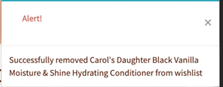
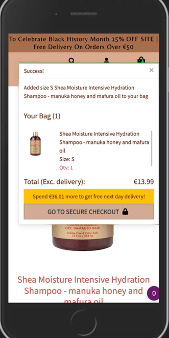
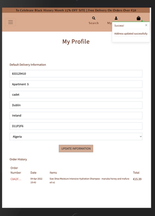
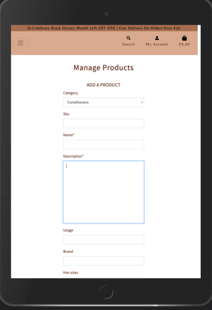
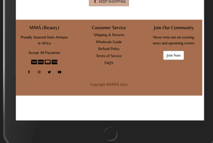

# MMÀ 

[Back To Main README File](README.md)

[View The Deployed Site](https://mma-beauty.herokuapp.com/)

## TESTING
<br/>

**Table of Contents** 
1. [Validator Testing](#validator-testing)  
   - [HTML](#html)   
   - [CSS](#css)
   - [JAVASCRIPT](#javascript)
   - [PYTHON](#python)

2. [User Stories Testing](#user-stories-testing)  
   - [UNREGISTERED SHOPPER GOALS](#unregistered-user-goals)   
   - [REGISTERED SHOPPER GOALS](#registered-user-goals)  
   - [ADMIN USER GOALS](#admin-user-goals)  
    
3. [Manual Testing](#manual-testing)   
   - [HOMEPAGE](#homepage)   
   - [PRODUCTS PAGE](#products-page)   
   - [PRODUCT DETAIL PAGE](#product-detail-page)   
   - [SHOPPING BAG PAGE](#shopping-bag-page)  
   - [CHECKOUT PAGE](#checkout-page)
   - [CHECKOUT SUCCESS PAGE](#checkout-success-page)
   - [REGISTER PAGE](#register-page)     
   - [PROFILE PAGE](#profile-page)
   - [LOGIN PAGE](#login-page)
   - [WISHLIST PAGE](#wishlist-page)
   - [SIGN OUT PAGE](#sign-out-page)
   - [ADD PRODUCT FORM](#add-product-form)
   - [EDIT PRODUCT FORM](#edit-product-form)
   - [DELETE MODAL](#deletemodal)

4. [Defensive Programming](#defensive-programming)

5. [Lighthouse Testing](#lighthouse-test)

6. [Further Testing](#further-testing)

7. [Solved Bugs](#solved-bugs)
   - [Unresolved Bug](#unresolved-bug)   

   
<br/>

### **VALIDATOR TESTING**
#### **HTML**
* [W3C Markup Validation](https://validator.w3.org/): This is also used to validate all newly created webpages' HTML code. Because of the django template used when you paste the direct html code, our code was discovered to have some errors. However, by right-clicking on our page and selecting "View page source," we were able to obtain the source code.

Some errors were discovered when we ran our product detail page through the validator. 


This was corrected by adding the aria-labelledby id to the h5 heading. When this was added, the errors were no longer visible.
 
* [Homepage](readme-files/readme/testing/htmlvalidation/home.png)
* [Profile](readme-files/readme/testing/htmlvalidation/profile.png)
* [All Product](readme-files/readme/testing/htmlvalidation/allproductspage.png)  
* [Checkout Success Page](readme-files/readme/testing/htmlvalidation/checkoutsuccess.png)
* [Product Detail Page](readme-files/readme/testing/htmlvalidation/productdetailpage.png)
* [Wishlist Item](readme-files/readme/testing/htmlvalidation/wishlistitem.png)

<br/>

#### **CSS**
* [W3C CSS validation](https://jigsaw.w3.org/css-validator/): This is used to validate the CSS code that is used on all webpages . The validator finds our code to be error-free.

 

 

<br/>

#### **JAVASCRIPT**
* [JSHint validation ](https://jigsaw.w3.org/https://jshint.com/): This was used to ensure that the JavaScript and Jquery code used on MMÀ was error-free. There were a few mistakes, such as missing semi-columns, which were corrected by inserting the necessary semicolons. 
Stripe was one of the undefined variables. This variable is referenced by the function.


<br/>

#### **PYTHON**
* [Pep8 Online validator](http://pep8online.com/): This was used to run our Python code to ensure that all errors, such as trailing whitespace, were removed. When this was run through the validator, it was discovered that some whitespaces were present and that some variables had been flagged. Such as 

 - On the checkout /webhooks.py file the local variable 'e' is assigned to but never used which is used in our try block. 

 - The following is marked as imported ```checkout.signals' imported but unused``` but unused in the checkout apps.py file, but it is used on the website.
 
 - Long characters in the projects folder ```settings.py file (Line 136-145) ```have been ignored in order not to break the functionality line.

 Except for the errors mentioned above, which were ignored, whitespaces were removed from all codes, allowing the code to be error-free.

<br/>

### **USER STORIES TESTING**
#### **Unregistered Shopper Goals**   
As a new/ unregistered user, I want to:
1. Quickly grasp the  purpose of the site

When a user arrives on the home page, the header image greets them and draws their attention to the site, keeping them interested. The user can easily navigate to the site's products by clicking on the "shop products" button. 

   

The user can hover over a fully responsive navigation bar. When the user hovers over the navbar items, the font colour for the icons changes to white, and the text expands with a white underline for the five menu links.

   

The website was created with the goal of being extremely user-friendly. When a user clicks on one of the links, he or she is directed to the appropriate page. When performing any of the basic CRUD functions, such as registering with MMÀ, they are also given useful feedback. 

   

The user can learn more about what MMÀ is about and why it was created by clicking the "about" link in the navbar. This gives the user a better understanding of how to improve their Afro texture hair and how to style their hair. 

   

2. Navigate the site easily to explore all of the site's features, such as product search

The site has been designed to be highly intuitive for the user by adhering to similar patterns already used in fashion industry website designs, such as the font style "Belleza" and the design webflow.

The user can easily navigate to their desired page by clicking on any of the navigation links. The search bar at the top of the navigation bar allows the user to easily search for products by name, brand, or category.


3.	View all of the products available on the site and be able to view each product individually to learn more about it.

When a user clicks the "shop products" button on the home page, they are taken to the all products page, which displays all of the products in the MMÀ database. On the navbar, there are three main categories: haircare, extensions, and accessories. When any of the categories is selected, subcategories within that category are displayed, directing the user to the various products available.


On the products page, the user can click the view details button to be taken to the product detail page, which contains additional information about each of the products.
    

4. Navigate the menu items to find products in various categories and other sections of the website. 

The user can easily navigate the site from the navbar by clicking on any of the categories and their subcategories that interest them. All links take the 
user to the correct page. 

 

On a tablet, the five navbar menu links collapse to a hamburger icon, which when clicked displays the navbar links that are centred. When hovered, the navbar links have the same design as the desktop navigation bar. 


When a user selects a category from the navbar and the page refreshes, the name of the category appears at the top of the page, informing the user of the sorted product category.

 

5. Be able to sort products by price, brand or rating

The user can easily sort the products on the products page at the top of the page by selecting one of the options from the sort selector box that deal with sorting the products price, rating, name, or category. This also informs the user of the total number of products available through that type.  

 

The user can also search for a product name, brand, or category in the navigation bar's search bar to sort the products on the page, which will yield some results.

 


6. Be able to add items to my shopping bag for purchases

The user can easily sort the products on the products page at the top of the page by selecting one of the options from the sort selector box that deal with sorting the products price, rating, name, or category. This also informs the user of the total number of products available through that type.  

 


7. Be able to view my shopping bag with products for purchase.

The user can view the products in their shopping bag by clicking on the shopping bag icon in the navbar. 

 

If no products are available in the shopping bag, the user will be notified and given the option to return to the all products page to continue shopping.

 


8. View the total of my shopping cart at any time on the site to ensure I am not spending more than I intended.

The user can view the products in their shopping bag by clicking on the shopping bag icon in the navbar. 

 

If no products are available in the shopping bag, the user will be notified and given the option to return to the all products page to continue shopping.

 


9. Easily checkout as a guest user without having to create an account, and receive an order confirmation once I have completed  purchase

Once the user has decided to pay for their purchase, they can easily navigate to the checkout page by clicking the "secure checkout" button on the shopping bag page. This enables the user to enter their personal information, delivery address, and payment information without having to create an account in order to complete their order.

 

Once the user has completed all of the required fields, the user will be presented with a thank you message that includes the order summary information. 

 


10. Be able to read product reviews for products.

When a user visits the product detail page, at the bottom of the page, they can view the product reviews, which may influence their purchase decision.


11. Join their community to stay up to date on afro textured hair products and information.

The user can scroll down to the footer and click the Join now button to receive email notifications about MMÀ products, or they can connect to their social media handles at the bottom of the page to stay up to date with news and products.


12. Be able to find information about their return policies, FAQs, shipping and returns, and so on

At the bottom of the page the footer ,the user can view more information about the MMÀ policies
  


13. Receive an email confirming my purchase.

After the user has made their payment and been provided with an order summary page, they will be sent an email confirming the order has been processed.


14.	Perform functions such as adding items to cart, editing the shopping cart, or deleting an item from the shopping cart, I would like to receive real-time useful feedback.

On the product detail page, the user can add an item to the bag by clicking on the buttons and receiving confirmation that the item has been added. They can also update the product quantity or remove an item from their shopping bag and receive feedback in their shopping bag. As the user interacts with the site, he or she will receive useful feedback. 


If the user's shopping bag contains no items, the user will be notified.


15. Be able to personalise my shopping experience, I should be able to sign up on the website and save my information in my profile for future purchases.

When a user is on the checkout page, entering their personal information and payment information, there is a link (login or create an account) under the delivery information input fields that allows the user to save their delivery information for future use.

16.	Locate the website's social media handles quickly to confirm their authenticity and build trust in the brand.


17.	Be  able to enter my payment information without difficulty during checkout, and the payment system is secure and safe.

When a user clicks the "secure checkout" button on the shopping bag page, they are directed to a checkout page with a secure payment system (Stripe). The user must enter their name, email address, delivery address, card number, CVC, and expiry date.


#### **Registered User Goals** 
As a returning/ registered user, I want to:
1. Be able to access all of the functionalities that an unregistered user/shopper can.

When a registered user logs into their account, they can see all of the pages that an unregistered user can see, as well as access to Wishlist items from the navbar, which unregistered users do not have. 


When the navbar collapses to a hamburger icon, the user can access the navbar items in the same way that an unregistered user would access the links.


2.	Receive an email confirming the creation of my account after. registering. 

When a user registers to create an account with MMÀ- Beauty, they are sent a confirmation email with a link to verify their email address in order to login to the new account.


3.	Easily Log in to my profile dashboard to view personal information like my default address and order history.

When a user logs into their newly created account, they can access their profile by clicking the "my account" icon and then selecting "my profile," which takes them to their profile account. 

If the user has previously purchased an item from the site, they can view their default delivery address and order history. If they only created the account, the user would only be able to see the order history header and the empty fields for delivery address. 


If the user decides to change or remove the delivery address from their profile, they can update the information in their profile. 


If they buy something, they will be able to see the delivery address used for their most recent purchase and  order history items. 


4. Easily Log out from my profile. 

The user can log out by clicking on the "my account" icon and selecting "logout" from the dropdown menu.


When a user clicks the logout link, they are directed to the account logout page, where they are asked to confirm that they want to sign out of the page. 


If the user chooses to continue, they will be easily logged out of their account and will receive an alert.


5. Be able to recover my password if I forget it, to access my profile.

On the login page, the user can click the "forgot password" link, which is located beneath the sign in button. If the user clicks the button, they are taken to the password reset page, where they must enter the email address they used to register in order to receive the forgot password link.


6. Be able to easily add product items to my Wishlist while browsing the website's products.

On the products page, the user can click the heart icon to add a product to their Wishlist basket while remaining on the products page. 


On the product detail page, the user can also click the add to Wishlist link or the heart icon, and the item will be added to their Wishlist basket and notified. When a product is added, the user is returned to the all product page.


7.	Be able to view my wishlist items and delete them when they're no longer needed.

When a user clicks the wishlist icon in the navbar, they are taken to their wishlist basket, which displays all of their favourite items. 


This display allows the user to either remove the desired item from the basket or view additional product information. Either of the actions is simple for the user to carry out.


8.	Be able to add reviews for products.

As the user scrolls down the product detail page, they can view reviews about the product, if there are any. If there are no reviews, the user will be given the option to "Add a review." 


When the link is clicked, a pop-up modal appears, prompting the user to enter their review and rating. 


When the user clicks submit, they will receive a feedback message thanking them for leaving a review. The user can also make changes to their review.


9.	Be able to edit a review that has already been posted for a product in order to update its content.

When a user leaves a review for a product, a thank you message appears above the reviews. The registered user can only edit their review, and they can only add one review per product. The edit modal appears when the user clicks the edit button. 


After editing, the user would receive the necessary feedback. 


10. Be provided with real-time useful feedback when I perform functions such as adding a review, adding items to a Wishlist, deleting items from a Wishlist, and so on.

As the user performs basic functions on the site, he or she will receive feedback. This notifies the user of their actions.




#### **Admin User Goals**
As an Admin User, I want to:

1.	Be able to perform all of the functions assigned to a registered user
When logged in as the admin user, I would see all of the navbar items that the registered user would see, which are easily accessible. I can look through the products page, search for products, leave a review, and edit a review.


2.	Restrict access to certain features, such as product management (add, edit, and delete products) and review deleting.

The user can easily access the "manage products" link on the navbar by clicking on the my account icon.


This takes the user to the add product form, where they can add products to the MMÀ database. 


The user can return to the all products page by clicking the cancel button, and to add a product, the user must click the "add product" button.


The admin user can navigate to the product detail page to access the  edit link which when clicked directs the admin user to the edit form. 


The edit product form automatically populates the product data. 


The user can update the new information by clicking the "update product" button and being directed to the product detail page, or they can cancel and be directed back to the all products page. 


The admin user has the ability to delete reviews left by other users. 


The admin user has the ability to add a review as well as delete their own review.


When an admin user attempts to delete a review or a product, a modal appears asking them to confirm their action. This prevents the admin from accidentally deleting an item. 


3. Be able to access the admin portal in order to view all orders and users. 

The admin user can access the Django admin site to manage the site's orders and products.

### **MANUAL TESTING**

Some automated testing was performed, but due to time constraints, manual testing was prioritised.

PLEASE NOTE :The stripe testing card is recommended for card payments as this is for educattional purposes.
Card number: 4242 4242 4242 4242  
CVC: any three numbers.
Date: Future Date

#### TESTING ALL FEATURES ON EACH PAGE 

#### **HOMEPAGE** 

 1. Navigation bar 

    1. Navigate to the Index page (Home) on a desktop by visiting the website. 

    2. Change the screen size of the desktop to that of a tablet device to ensure that the navigation bar is responsive and changes to a hamburger icon as the screen width decreases to that of a tablet or mobile device. Menu items should be hidden in the hamburger icon for medium to small devices, and the navigation bar should be sticky. 

         When testing responsiveness across different devices, there was no overflow of the navbar. The navbar did not overflow when tested for responsiveness across multiple devices. The navbar functions as expected. 
         
         The navigation bar menu changes to a hamburger icon on a tablet or mobile device, with the menu icons appearing on the right side of the navbar. The user can access the page's five different navbar links by clicking the hamburger icon. The links in the navigation bar are centred and, when clicked, display the expected categories and subcategories. 

        

        The navigation bar remains visible as the user scrolls down the page, allowing the user to.

    3. Hover your mouse over the navbar menu items and icons, then click on each link to be taken to the correct page.

          The menu links work as expected across all devices when tested. The user is directed to the appropriate pages that display the various products and categories. When the user hovers over the menu icons and clicks them, a dropdown box for "my account" icon appears, allowing the user to access their profile or logout page, register/sign In page. When the various links are clicked, the user is directed to the appropriate page, as expected.

          

          

          

    4.	Make sure the banner is at the top of the navigation bar and that it is responsive on all devices. 

         When tested on all devices, the banner appears at the top of the navigation bar and adjusts to different screen sizes. The banner does disappear as the user scrolls down the page, and the user can only see the navigation bar as they interact with other sections of the page.

    5. Hover the mouse over the menu items to ensure that a white underline appears and that the menu item text expands when hovered. The font colour       should change when the mouse is hovered over a menu icon.

         When tested on a desktop device by hovering the mouse over the menu item in the navigation bar, the text expands with a white underline. The same effect occurs on tablets and mobile devices. When the user hovers the mouse over the menu icons in the navigation bar, the font colour changes to white, as expected on all devices.

    6. On a desktop screen, confirm that when the MMÀ logo is clicked, the user is directed to the home page.

         The stated effect occurs on a desktop device; when the logo is clicked, the user is directed to the home page.

    7. Verify that the search bar in the navigation bar is responsive and located in the centre of the page. The user should also be able to use the search function on a tablet or mobile device.

         On a desktop device, the search bar is centred as expected and responsive to changes in screen width. When the device's screen width is reduced to that of a tablet or mobile device, the search bar collapses and is represented by a search icon. When the user clicks the icon, the search bar appears, and the user can use the search functionality. 

         
    
    8. Change the screen size to that of a tablet or mobile device and check that clicking the hamburger icon displays the navbar menu links in a dropdown box with the links in the centre. The navbar links should have the same effect as if they were on a desktop device.

         The hamburger icon appears as expected when the width of the navigation bar is changed to that of a tablet device. When you click the hamburger icon, the navlinks appear in a dropdown box that is centred and behaves exactly like a desktop device when hovered over.

    9. Confirm that the navigation bar menu icons is different for a guest user and a registered user. 

         When tested on a desktop device, the navbar menu icons for a guest user and a registered user actually differ. The wishlist icon is not visible to the guest user, but it is visible to the registered user at the top of the navbar on a desktop device. The wishlist page can be accessed from the my account icon dropdown box on a mobile or tablet device for a registered user.

         


2. Hero image  

    1.	On all devices, ensure that the hero image is visible and takes up the entire width of the screen. 
         The hero image fills the entire screen width on a desktop with no overflow issues. The same effect occurs when the screen size is changed to a tablet or mobile device; the hero image takes up the entire screen width, but the image on a mobile device differs from that on a desktop or tablet device.


  

3. Button

    1. Confirm that when hovered over, the button under the header text changes colour and directs the user to the correct page when clicked.
        
         When this is tested, it can be seen that when the button is hovered over, a light box shadow appears and the background colour of the button changes. When the user clicks the button, he or she is taken to the all products page. 

4. Footer 

    1. Scroll to the  bottom of the page to access the footer. 

    2. Adjust the device's screen width to see if the footer content is responsive. On a mobile device, ensure that the join our community section in the desktop footer is hidden. All links in the footer should take the user to the right page.
         
         When tested on a desktop device, the footer content is displayed in three columns, with the text visible in each column. The second column contains customer service links, which, when clicked, take the user to the desired page, in this case, the about page.

         All of the customer service links function properly, directing users to the appropriate pages. The third column allows the user to join the MMÀ community by clicking on the "join now" button, which, as expected, takes the user to the about page. 

         The footer content adjusts to fit as the width of the screen changes. The size of the text and icons has been reduced. On a mobile device, however, the third column with the join now button  is hidden, making the footer appear cleaner and less crowded


    3. Hover your mouse over the social media icons in the first column and confirm that if the mouse is hovered over the menu icons, the colour changes and the user is directed to the appropriate MMÀ social media page.

        When testing this on all devices and hovering over the social network icons, each icon has a background overlay with a box shadow when hovered. This informs the user of which icon is currently selected. The outcome is as expected.

        

<br/>

#### **PRODUCTS PAGE** 

1. Navigate to the all products page by selecting the category all products from the navbar's all products dropdown menu.
        
2. Confirm that the sort selector dropdown box is on the page and that the user can sort products by price, rating, name, and category.
 
     When tested on a desktop device, the sort selector can be seen on the page, located on the left side of the page. The user can select any of the sort options by clicking on the selector box. If the user selects any of the options (price, rating, name, and category), the products will be sorted in the expected order. The same effect occurs on a tablet and a mobile device. The sort selector is placed above the products on a mobile device. 

3.  Confirm that the total number of products displayed when sorted is correct, and that the total number of products in each category is displayed when the user clicks any of the navbar menu links with that category

     When a user sorts the products on a desktop device using the sort selector box, the user is informed of the total number of products available on the left side of the page. The total number of products can be seen below the selector box on a mobile device. 
 
     When a user clicks on one of the categories in the navbar, the site reloads and displays the category name as well as the total number of products in that category. The same effect occurs when you use a tablet or a mobile device as expected.
    
     


4.  Confirm that clicking the "Product Home" link next to the total number of products takes the user to the desired page.

     When clicked, the "Product Home" link located beside the total number of products for all screen devices refreshes the product page, displaying all products in the MMA database, with the link disappearing after the page refreshes. 

     

5.  Confirm that when a user queries the search with a product name, brand name or category name, the results are displayed and that if no results are found, a message informing the user is displayed.
     When tested across all devices, the search bar queries the user's search after the user enters a product name/brand name/category name, displaying the results and total number of products found in that search. 

      

      If no results are found, the user will be notified. 

      

      To reset the search function, the user would need to click the "Products Home" link, or the user could click on the search icon on the navbar.

      

6. 	Confirm that the products are displayed in a card container design and are presented in four equal columns for a desktop device, two columns for an iPad, and one card container column for a mobile device. An image, some text, an icon, a category, and a button should all be included in the product card container. On a mobile device, the product cards should collapse and each product card should take up the entire width of the screen. The user should be able to click the image and be taken to the product detail page.

     The products are displayed in four columns on a desktop device, three columns on a medium screen, and one column on a small screen. As expected, the product card container includes the product name, price, rating, heart icon, category, and view details button.

      

    When the screen width is reduced to that of a mobile device, the products collapse to one column that occupies the screen width, with the card details below. If the user clicks on the image, he or she will be taken to the product detail page, as expected.

      

7.  Confirm that the links in the product card container take the user to the correct page and allow them to perform the desired function. 

     If the user is a registered user, they can click on the heart icon in the product card container where they can view the product rating to add items to their wishlist basket; if the user is not registered, they will be taken to the login page and once signed in, the product will be added to their wishlist basket and directed back to the product detail page. When the user performs actions on the site, they will receive the necessary feedback.

     If the user clicks on the category link under the heart icon, the user will be taken to that category page, which will display all of the products in that category as well as the total number of products available, as expected. To return to the all products page, the user must click the "Product Home" link.

     


8.  Confirm that when the "View Details" button in the product card is clicked, it takes the user to the appropriate page and that the text in the button expands when the mouse is hovered over the item.

     When the mouse is hovered over the button during testing, the text expands and the font colour changes as expected. The button is placed at the bottom of the card and adjusts to the width of the screen as it is increased /decreased. The user is directed to the product detail page when he or she clicks the button.


     
<br/>

#### **PRODUCT DETAIL PAGE**

1. Navigate to the all products page by selecting the category “all products” from the navbar's all products dropdown menu. On the all products page  click the view details button . 

2. Confirm that the add to Wishlist icon works properly and that the category tag located beneath the icon directs the user to the correct page..

     When tested across all devices, it can be seen that when the user hovers over the "Add to wishlist") icon, the text changes colour, and when the icon or text is clicked, the user is notified that their product has been added to their wishlist basket and is directed back to the product detail page. If the product is already in the user's wishlist basket, the user is notified.

     

     When a user clicks on the category tag, they are directed to the category page, which displays the products in that category as expected.

3. Confirm that the product size box works as it should and that the quantity button is functional and responsive.
 
     Testing this on all devices reveals that not all products have a size box, but the products that do have sizes have a dropdown box that displays all of the sizes available. As expected, the user can easily select any of the sizes. 

     The quantity box, located beneath the size box, allows the user to reduce or increase the quantity of products required for purchase. The user must select a quantity between 1 and 99. 
     The size dropdown box and the quantity box adjust to fit all screen sizes while remaining visible on the page


4. 	Confirm that when the buttons are hovered over, a box shadow appears and the text changes colour, directing the user to the desired page when clicked.

    When this test is run on all devices, it is clear that when the mouse is hovered over the buttons, a box shadow appears and the text colour changes to white, as expected. The box shadow's purpose is to make the buttons more visually appealing. When the button is clicked, the user is either returned to the all product page or the product is added to their shopping bag with the quantity and size selected, if applicable.

     

5. Confirm that clicking on the product image opens the image in a new tab.

     When tested on all screen devices, the user is directed to a new tab with an enlarged image of the product when the image on the product detail page is clicked.

6. Check that registered users can leave reviews for each product. Each product should allow the user to leave one review. If the user is not already registered, they must sign up in order to leave a review.
     Testing this on all devices reveals that if the user does not have an account, they will need to sign in or register in order to leave a review.
    
      

     If the user is logged in, he or she can add a review. The add review modal form appears, and once submitted, the user receives a thank you message. By clicking on the edit link, the user can also edit their own review. 

     When a registered user clicks on the edit link, the edit review form appears, and the user must enter the new review and rating before receiving feedback.

      


<br/>

#### **SHOPPING BAG PAGE**

1. To access the shopping bag details on a desktop device, click the shopping bag icon. 

2. Confirm that the price of the shopping bag can be seen on the page as the user interacts with different sections of the website.

     Upon testing this on all devices, it was discovered that the user can see the total price of their bag from the shopping bag icon, ensuring that they are spending within their budget as planned.

      

3. Confirm that products in the users shopping bag can be updated and removed. 

     When the quantity box is adjusted by increasing or decreasing the quantity symbols and the user clicks the update link, it can be seen on all devices. The new quantity is applied to the products, and the user is notified of the subtotal.

      

     If the user decides to remove an item from their shopping bag, they can do so by clicking the "remove" button, which removes the item and notifies the user. If there are no items in the shopping bag, the user receives a message that says "no results found.

       


4. Confirm that when a user adds an item to their bag, they receive a feedback notification with the product name, image, and delivery fee.

     When tested on all devices, it can be seen that when a user adds an item to their shopping bag, the user receives a notification that the item has been added to their bag, which displays the product name, image, quantity, size if any, total, and delivery price, as expected. When the user clicks on the icon, they will be able to see all of the items in their shopping bag.


5. Confirm that the buttons on the page, when clicked, take the user to the appropriate pages and have a box shadow when hovered over.

     When tested on all screen devices, the box shadow appears as expected and the text colour changes to white when the mouse is hovered over it. If the user clicks the "Keep Shopping" button, they will be directed back to the all product page, while clicking the "Secure Checkout" button will take them to the checkout page.

       


#### **CHECKOUT PAGE**

1. The user would need to click the shopping bag icon to get to the checkout page. If there are products in the shopping bag, the user can access the page by scrolling to the bottom of the page and clicking on the "secure checkout" button.

2. Confirm that the user must fill out all mandatory fields before submitting the checkout form. If the fields are not properly filled out, the user should receive a validation message.

     Testing  the form for an unregistered user on all devices it can be seen that the user would need to provide some mandatory fields in order for them to be able to submit the form to process their order. The fields that are mandatory there is a placeholder in the input field with an asterisk mark showing that the field is required.

      

     Testing the form for an unregistered user on all devices reveals that the user will need to provide some mandatory fields in order to submit the form and have their order processed. The mandatory fields have a placeholder in the input field with an asterisk mark indicating that the field is required. 

      

     If any fields are left blank, the user is notified when they click the submit button. If the user enters incorrect information or fewer characters than required, the form prompts them with a validation message stating what is expected.

     The user must provide their payment card information; in this case, the user must use the default stripe test card details, which are

      

     Once the user has entered their credit card information, they will be able to process their order by clicking the complete order button.

     The same effect occurs for a registered user, but under the delivery input field, the user can select the save delivery information option, which allows the user to save the address in their profile. If the user checks this box, they will be able to save their address for future purchases. 

       

      After the registered user has filled out all of the input fields with the necessary information, they can proceed to process their order by clicking the completer order button.

3.  Confirm that the buttons on the page, when clicked, take the user to the appropriate pages and have a box shadow when hovered over.

     When tested on all screen devices, the box shadow appears as expected, and when the mouse is hovered over it, the text colour changes to white. If the user clicks the "Adjust Bag" button, they will be returned to the shopping bag page to adjust the bag items, whereas clicking the "Complete Order" button will take them to the checkout success page.

<br/>

#### **CHECKOUT SUCCESS PAGE**

1.  To access the checkout page, the user would need to click the shopping bag icon. If the user has items in their shopping bag, they can access the page by scrolling to the bottom of the page and clicking the "secure checkout" button.

2.  Confirm that when the user clicks the  “secure checkout “ button  they are directed to the checkout success page that displays the order summary 

     When tested on all screen devices, it can be seen that when the button is clicked, the user is directed to the appropriate page, which displays the order summary for the user in a box, as expected. A notification alert informing the user that their order has been sent to their email address is also provided.

      

3. Confirm that the button on the page, when clicked, take the user to the appropriate page and has  a box shadow when hovered over.

    When the mouse is hovered over the buttons, the button expands with a box shadow present on all devices. When the user clicks the button, he or she is directed to the desired site on a new page, as expected.

4. Confirm that the user receives an email confirmation once their order has been processed.
     When the user clicks the "Secure Checkout" button and their order is processed, they will be emailed a confirmation email. This email contains the order details, date, order total, and so on. The email is sent from the official email address of the website. 

      
<br/>

#### **REGISTER PAGE**
1. On a desktop, navigate to the my account icon and select from the dropdown menu “register” .

2. Before submitting the sign up form , confirm that the user must fill out all mandatory fields. If the fields are not filled out correctly, the user should receive a validation message.

     Testing this on all devices reveals that when a user attempts to register for an account with MMÀ, they must provide the mandatory fields indicated by an asterisk beside the input name. This is to inform the user that those fields are required in order to sign up successfully. If the fields are not filled out, the user will be notified and a validation message will be displayed. 

      

     If the user completes all of the fields and clicks the "sign up" button, he or she is directed to the email confirmation page.

3. Confirm that a box shadow appears when the user hovers over the "Sign up" button on the page and that clicking it takes the user to the verification email page.
     When tested on all devices, a box shadow appears and the text colour changes when the user hovers over the "Sign Up" Button. When the user clicks the button, they are taken to the page where they can verify their email address, and an alert appears at the top of the page informing them that a confirmation email has been sent to them as expected. 

      

4. Confirm that when a user registers for a new account at MMÀ, they will receive an email with a confirmation link that, when clicked, will take them back to the confirmation email page on the MMA website.

     When a user registers for an account with MMA on any device, a confirmation email is sent to the user. 

     

     If the user clicks on the verification link in the email, they are redirected to the website and asked to confirm their email address.

     

5. Confirm that when a user clicks the "Confirm" button on the website's confirmation email page, they are directed back to the login page where they can enter their login information.

     When tested on all devices, it can be seen that when the user clicks the confirm button, they are directed back to the login page and asked to enter their email and password to login to their newly created account, once their email has been confirmed.

     

<br/>

#### **ABOUT PAGE**
1. On the navbar navigate to the about page.

2. Confirm that the text header has an animation effect and that the tagline text is visible when the about page loads on all devices. The text should be responsive on all devices.
     The stretch animation effect was present when tested on all devices. The same thing happens when you use a tablet or a mobile device. For tablet and mobile devices, the font size adjusts to the screen size, keeping the screen clean and visually appealing.

      

3. As the screen width changes, check that the images and buttons are responsive.
     When the screen width is changed to that of a tablet device, it is clear that the images are responsive as expected, adjusting to the size of the various screens as well as the buttons on the page.

4.	Confirm that when a button on the page is hovered over, it expands in size and that clicking it takes the user to the appropriate site on a new page or within the site.
     When the mouse is hovered over the buttons, they expand and have a box shadow, which is present on all devices. When the user clicks the button, he or she is expected to be directed to the desired site within the website or to a new page if it is an external website.

      


#### **PROFILE PAGE**
1. When you login or register, the user can access the profile page by clicking on the my account icon. A drop down menu appears, and they can select the "my profile" menu link.

2. Confirm that the user's personal information appears correctly when he or she signs in and their order history is visible. The page content should be responsive on all devices. 
     When tested on a desktop device, the delivery address and order history can be seen on the page. Which is divided into two equal columns. On the left, you can see the delivery address, and on the right, you can see the order history. 

     The two columns collapse to one column on a tablet or mobile device, and the delivery address appears above the order history. Displaying the user's default delivery address for their most recent purchase if they saved their delivery address, whereas for a new user, the delivery address input fields are empty and there is no order summary history available. 

      

     The input fields and the order summary table can be seen to be responsive across all screen sizes.

     The input fields and the order summary table can be seen to be responsive across all screen sizes, adjusting to the screen size accordingly.

3. Confirm that when the user hovers over the "Update Information" button on the page, a box shadow appears and that clicking it allows them to update their default delivery address.

     When tested on all devices, it can be seen that when the user hovers over the "Update Information" Button, a box shadow appears and the text colour changes. When the user clicks the button, the profile page reloads with the updated information, and the user is notified of the change. The expected effect occurs. 

     


4. 	When the order number is clicked in the order history, the user should be directed to the order summary page for that order.
     When tested across all devices, it is clear that when the user clicks on the order number, the user is directed to the order summary page for that order. This allows the user to easily track their orders through their profile

#### **LOGIN PAGE**
1.  If you are returning user you can click on the my account icon on the navbar and select the “sign in “ link to access the login page. 

2. Confirm that the user must fill out all mandatory fields before submitting the sign in form. If the fields are not correctly filled out, the user should receive a validation message.
     When tested across all devices, it is clear that the mandatory fields have been identified for the user by adding an asterisk to the input field name. This notifies the user that all fields must be completed in order to sign in to their account. If the user does not provide an input, they will receive a validation message.

      

3. Confirm that the forgot password link is operational and that the user can enter their email address to obtain a new password.
     On the sign in page, the user can access the forgot password link by clicking on the "here" link located after the forgot password text. When the user clicks, they are directed to the password reset page, where they are asked to enter their email address in order to reset their password.

       

     If the user wants to reset their password, they can fill out the input field and click the button, which will take them to the password reset done page, which will notify them that an email has been sent to reset their password. 

     

     The user would receive an email requesting that they reset their password.

      

4. Confirm that when the Sign In button is clicked, it takes the user to their account and that the box shadow appears when the mouse is hovered over it.

     When tested on all devices, it can be seen that when the user clicks on the sign in button, the user is logged into their profile and the homepage is displayed to them. When a user signs in, they are notified. The box shadow is present on the Sign In button, and the text changes colour as expected.

5.  Confirm that clicking the return to Home link takes the user to the homepage.

     When tested on all devices, it can be seen that when the user clicks the return home link located beneath the forgot password text, the user is directed to the home page as expected.

#### **WISHLIST PAGE**
1.  Click on the wishlist icon in the navbar to be directed to the registered user's wishlist basket. To access the wishlist menu on a tablet or mobile device, click the "my account" icon.

2. Confirm that when a user clicks the wishlist menu link or icon, they are directed to their Wishlist basket.

     When tested on all devices, the stated effect occurs: when the icon or Wishlist menu link is clicked, the user is directed to their wishlist basket, which displays all of the products they would like to purchase in the future.

3. Check that the buttons on the wishlist page perform their intended function.
     When tested on a tablet device, the Wishlist basket adjusts to the screen size, and the buttons available to the user are "Product Details" and "Remove." When the product details button is clicked, the user can view more information about the product, and the Remove button, as expected, allows the user to remove the product item from their shopping bag. If a user removes an item from their Wishlist basket, they are notified, and if no products are available in the basket, the user is notified.

      


#### **SIGN OUT PAGE**
1. If you are a registered user, go to the navbar, my Account menu icon, and select the Sign out option.

    

2. Confirm that the sign out page includes a sign out button that, when clicked, allows the user to log out of their account. The provided links should also allow the user to return to the all products page.
     When tested on a tablet device, the Wishlist basket adjusts to the screen size, and the buttons available to the user are "Product Details" and "Remove." When the product details button is clicked, the user can view more information about the product, and the Remove button, as expected, allows the user to remove the product item from their shopping bag. If a user removes an item from their Wishlist basket, they are notified, and if no products are available in the basket, the user is notified.

      


#### **ADD PROODUCT FORM**
**( Add Product)**

1. Confirm that the admin can see the "manage product" link when they log in to their account.. 
     When an administrator logs in and clicks on the my account menu, they can access the manage products link on both mobile and desktop devices. When an admin clicks on the link, they are taken to the add product form.

2. Confirm that the admin user  must fill out all  the mandatory fields before being able to add a product. If the fields are not correctly filled out, the user should receive a validation message.

     When tested across all devices, it is clear that the mandatory fields have been identified for the user by adding an asterisk to the input field name. This notifies the admin user that all  required fields must be completed in order to add a new product. If the user does not provide the necessary input , they will receive a validation message.

     

3. Confirm that after filling out the required fields, the user will be able to add a product and be directed to the product detail page of that new product.
     When tested on all devices, the admin is able to add a product to the database by clicking the add product button after filling out the mandatory fields on the form. If the admin user does not want to continue, they can click the cancel button, which has a black background colour when hovered over. The "add product" button on the website has the same effect as the "register" button. 

     Once the new product is added, the user will be able to view the new product's product detail page as expected.

     

<br/>

#### **EDIT PRODUCT FORM**

1.  On the product detail page, confirm that when the admin user clicks on the edit function below the keep shopping button. The edit form page is displayed, and the form is pre-populated with data.

     When tested on all devices, it can be seen that when the admin user clicks on the edit link under the keep shopping button, they are directed to the edit product form page, which displays the prepopulated data of the product to be edited, exactly as expected.

     


2.  Confirm that when a user clicks the "update product" button, the product is updated and that when the user cancels, the user is returned to the products page.

     When tested on all devices, it can be seen that when the user clicks the update products button, after updating the fields they want, they can click the update button to update the product data, and if they want to return to the all products page, they can click the cancel button. The desired result is obtained.

<br/>

#### **DELETE MODAL**
**( Delete Review, Delete Product)**

1. Confirm that when the "delete" link on the product detail page is clicked, a modal appears asking the administrator to confirm their action. 
     
     The relevant product is deleted if the user clicks Delete. When tested across all devices, the modal appears when the admin clicks the "delete" link. A dialogue box appears, requesting confirmation from the user that they want to perform the desired function. The product is deleted from the website database when the user clicks the delete button. 

     


2. Confirm that, in response to the admin's action, a notification appears at the top of the screen.
     
     When the user clicks the delete link, he or she receives feedback on the just completed action, as expected. The user is returned to the all products page.

     

3. Confirm that the "Cancel" link, when clicked, returns the user to the appropriate page.
     When tested on all devices it can be seen that the cancel button directs the user back to the product detail  page, and the dialogue box disappears.

4. Confirm that the admin user has permission to view and delete other user reviews. The admin should also be able to add reviews, edit their reviews, and delete reviews.
     When an admin user logs in, they can view reviews just like any other unregistered or registered user. When the admin clicks the add review link, a modal appears, allowing the admin to add a review. Once added, the administrator has access to the edit and delete links. If the user clicks the edit link, the edit review modal appears, just like it does for other users, allowing the administrator to make changes.

     

     When an admin user clicks the delete link, a modal window appears, asking the user to confirm that they want to perform the desired function. 
    
      

     When a user clicks the delete button, the product is removed and the user is notified.
     
     

<br/>

### **DEFENSIVE PROGRAMMING**

Some defensive back end programming has been put in place to limit users' access to certain functions.

1.	Only the admin user can add a product, edit a product form, delete reviews, and delete products. The admin user's "my account" menu icon includes an additional link for managing products (add product), which allows the user to add products to the database.

2.	When a user registers or logs in, they can see all of the reviews that other users have left, but they can only leave one review per product. The user has the ability to edit but not delete their reviews. When the user is viewing the product reviews of other users, they will notice that the edit button is only available for reviews left by them.

3.	 If the user registers for an account with MMÀ, they will notice that in order to access the wishlist basket on a mobile device, the user must click on the "my account"menu icon and select Wishlist from the dropdown menu. The user is then directed to the Wishlist page.

4.	If the user is unable to provide an image url for the add product form, the new added product will be displayed with a default image. 

5.	To edit or delete a product, the admin user can  only access this functions. They can use the edit and delete functions on the product detail page.

6.	The admin user performs the same tasks as the registered user. When viewing each review, however, the admin user has the option to delete the reviews. 


</br>

### **LIGHTHOUSE TEST**
The lighthouse test was used to assess the performance, accessibility, best web practises, and SEO of our website. The lighthouse suggestions were used to improve the website's performance by applying the lighthouse suggestions to boost the scores. The results of the lighthouse tests for MMA are shown in the table below.

Page Name | Performance | Accessbility | Best Practices | SEO | See link   
--- | --- | --- | ---  | --- | ---    
about.html |  97 | 94 | 92 | 100 | [see here](readme-files/readme/testing/Lighthousetest/AboutPage.png)  
profile.html | 90 | 97 | 92 | 100| [see here](readme-files/readme/testing/Lighthousetest/myprofilepage.png)     
checkoutsucess.html | 97 | 96 | 92 | 100 | [see here](readme-files/readme/testing/Lighthousetest/Checkoutconfirmation.png)    
bag.html | 90 | 88 | 92 | 90 | [see here](readme-files/readme/testing/Lighthousetest/shoppingbag.png)   
register.html | 97 | 96| 92 | 90 | [see here](readme-files/readme/testing/Lighthousetest/Register.png)    
login.html | 98 | 96 | 92 | 90 | [see here](readme-files/readme/testing/Lighthousetest/login.png)   
checkout.html | 88 | 94 | 92| 100 | [see here](readme-files/readme/testing/Lighthousetest/Checkout.png)  
index.html | 98| 96| 92| 100 | [see here](readme-files/readme/testing/Lighthousetest/Home.png)  
product_detail.html | 97 | 87 | 92 | 90 | [see here](readme-files/readme/testing/Lighthousetest/productdetaillight.png)
wishlist.html | 92 | 97 | 92 | 90 | [see here](readme-files/readme/testing/Lighthousetest/wishlistlight.png)   

<br/>

### **FURTHER TESTING** 

This site was tested on a desktop (Mac OS and Windows), iPad, iPadPro, iPhone (6,7,8, and SE), and Pixel2 device to ensure that it was error-free and responsive on all pages. Additional testing was conducted by allowing some users to shop on the site.

Some feedbacks were provided.

1.	One of the comments received was that they received duplicate emails after processing their order, which was resolved by disabling the email password for one of my Gmail accounts. This fix resolved the problem, and the user received only one confirmation email.. 

2.	Another issue was that they were unsure how the edit review form functioned. They were unsure whether they needed to add a new review because the prepopulated data did not appear. This was fixed by inserting a small message beneath the edit review form informing the user that the review being edited is their previous review.

    

     After the fix was applied, the user was directed to the updated site to shop again and provide feedback on the website's customer experience. The site was easier to use and more clear, according to the users.


3. [AM I Responsive](http://ami.responsivedesign.is/) was used to capture the aesthetic look and responsiveness of MMÀ across all devices. Screenshot is below 

    

<br/>


### **SOLVED BUGS**

1. In order to display the correct message to the user when they left a review  some conditional  rendering was used on the product detail page. Initially the  if statement applied was ``` ( % if reviews.count % ) ``` which targeted the profile user . Its aim was to target if the user had a profile and their reviews were more than one for a product the user would be provided with a thank you message.

     On the product detail page, conditional rendering was used to display the correct message to the user when they left a review. The first if statement used was ```( % If reviews.count % )```, which targeted the profile user. Its goal was to target if the user had a profile and more than one review for a product, the user would be sent a thank you message after adding a review. 

     This was fixed by calling the review by user in the product detail views.py file and calling the user from the reviews. By including this function, I was able to call the reviews from user function in the template and fix the conditional rendering, allowing the user to see a thank you message once they had completed the form. 

     
    
     Some back end defence has been included in the reviews view.py file to ensure that no user can manipulate adding a review. 
     
     

     This ensures that the user must be registered before leaving a review and that the user cannot leave two reviews for the same product.

2.	The footer was not staying at the bottom of the page on the shopping bag page and All authentication files. The first fix was to use the recommended bootstrap [method](https://getbootstrap.com/docs/5.0/examples/sticky-footer/), but this affected the navigation bar and the banner on the home page. I tried removing the home page from base.html and making it its own independent document, but some features on other pages did not work.


    

    To correct the error, the contents of the bag and the authentication forms were all wrapped in a wrapper with padding and margin. This allowed the footer to be pushed down and appear at the bottom of the pages.

3.	When the user completed their order, they received two confirmation emails. The emails came from Boutique Ado and MMA-Haircare. This was odd because when I contacted student support, they were unsure what the problem could be because the codes were correct. The email address for the MMA website was created from scratch and is linked to my Gmail account. I double-checked that the app passwords for boutique ado and MMA were distinct, which they were, but the problem persisted.
    This was resolved by disabling the app password for the boutique Ado email address. With the new fix, when a user processes an order payment, MMA-haircare sends them only one email.

    
    

4.	During testing, it was discovered that when the screen width was reduced to that of a mobile and tablet device, the add to Wishlist text present under the heart icon was missing and had to be added by removing the d-none class present on the add to Wishlist text on large screens. This fix made the text "Add to Wishlist" visible on smaller screens.

5.	To improve the site's accessibility score, the colour class used on the website as color-pink was changed to another bright pink colour so that the contrast between some of our description text and the background was clear. 

     This new fix increased the visibility of the text for users ```color-pink: color:#dc3545)```.

4.  When manually testing all pages, it was discovered that some notifications, such as adding a review, editing a review, deleting a product, and editing a product, displayed the bag contents as they provided feedback to the user, which was a bit crowded and unnecessary because the user can still view the shopping bag total price from the navbar. To remove the contents of the bag, the message notification for these functions was changed.

5. Manual testing revealed that the quantity box on the shopping bag page allowed the user to order products in minus numbers. This was changed by modifying the shopping bag quantity form and removing the duplicated form from the bag.html file for larger devices. This modification had an impact on the design of the product detail page and the shopping bag page. This new fix allows the user to order items in positive numbers, and the decreases button is disabled when the user is down to one. 

     When the new buttons are tested on the quantity box, they function as expected. The decrease button is disabled once the quantity is reduced to one.
    

    

