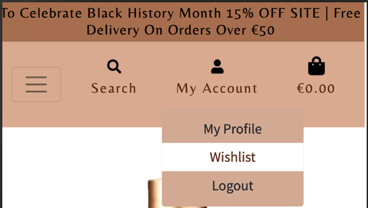
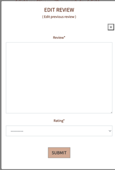

# AYO RECIPES 

[Back To Main README File](README.md)

[View The Deployed Site](https://mma-beauty.herokuapp.com/)

## TESTING
 

**Table of Contents** 
1. [Validator Testing](#validator-testing)  
   - [HTML](#html)   
   - [CSS](#css)
   - [JAVASCRIPT](#javascript)
   - [PYTHON](#python)

2. [User Stories Testing](#user-stories-testing)  
   - [UNREGISTERED SHOPPER GOALS](#unregistered-user-goals)   
   - [REGISTERED SHOPPER GOALS](#registered-user-goals)  
   - [ADMIN USER GOALS](#admin-user-goals)  
    
3. [Manual Testing](#manual-testing)   
   - [HOMEPAGE AS A GUEST](#homepage-as-a-guest-user)   
   - [RECIPES PAGE](#recipes-page)   
   - [LOGIN](#login-page)   
   - [REGISTER PAGE](#register-page)  
   - [SIDE NAVIGATION](#side-navigation)
   - [TIPS & TRICKS](#tips-tricks-page)      
   - [PROFILE](#profile-page)
   - [ALL ADD FORMS](#all-add-forms)
   - [ALL EDIT FORMS](#all-edit-forms)
   - [ALL DELETE FORMS](#all-delete-forms)

4. [Defensive Programming](#defensive-programming)

5. [Lighthouse Testing](#lighthouse-test)

6. [Further Testing](#further-testing)

7. [Solved Bugs](#solved-bugs)
   - [Unresolved Bug](#unresolved-bug)   

   
 

### **VALIDATOR TESTING**
#### **HTML**
* [W3C Markup Validation](https://validator.w3.org/): This is also used to validate the HTML code for all newly created webpages. Our code was discovered to have some errors as a result of the jinja template used when you paste the direct html code. However, this was resolved by obtaining the source code by right-clicking on our page and selecting "View page source." The errors are removed when checked again. 
* [Homepage](static/images/readme/html/homepage.png) 
* [Profile](static/images/readme/html/profile.png) 
* [Recipes](static/images/readme/html/recipes.png)  
* [Tips & Trick](static/images/readme/html/tips&tricks.png)  
* [Manage Categories](static/images/readme/html/manage-categories.png)  
* [Add Category](static/images/readme/html/addcategory.png)  
* [Edit Category](static/images/readme/html/edit-category.png) 
* [Single-recipe](static/images/readme/html/single-recipe.png)  
* [Login page](static/images/readme/html/login.png)
* [Edit profile](static/images/readme/html/edit-profile.png)
* [View_category](static/images/readme/html/view_category.png)
* [Register](static/images/readme/html/register.png)
* [Add Recipe](static/images/readme/html/addrecipe.png)
* [Edit Recipe](static/images/readme/html/edit-recipe.png)

 

#### **CSS**
* [W3C CSS validation](https://jigsaw.w3.org/css-validator/): This is used to validate the CSS code used on all webpages created. Our code is found to be error-free by the validator.

 

 

#### **JAVASCRIPT**
* [JSHint validation ](https://jigsaw.w3.org/https://jshint.com/): This was used to validate the JavaScript and Jquery code used on Ayo Recipes to ensure that it was error-free. The script.js file was added to all pages, and the addscript.js file was added to the recipe add/edit page. It was discovered that some semi-colons were missing when this was first run. This was fixed by inserting the necessary semicolons.

 

#### **PYTHON**
* [Pep8 Online validator](http://pep8online.com/): This was used to run our Python code in the app.py file to ensure that all errors were removed, such as whitespace, trailing whitespace, and so on. When this was run through the validator, it was discovered that there were some whitespaces that were removed. 

 

### **USER STORIES TESTING**
#### **Unregistered Shopper Goals**   
As a new/ unregistered user, I want to:
1. Quickly grasp the  purpose of the site

When a user arrives at the home page, the header image greets them and draws their attention to the site, keeping them interested. The user can easily navigate to the site's products by clicking on the "shop products" button. 

   

The user can hover over a fully responsive navigation bar. When the user hovers over the navbar items, the font colour for the icons changes to white, and the text expands with a white underline for the five menu links.

   

The website was created with the goal of being extremely user-friendly. When a user clicks on one of the links, he or she is directed to the appropriate page. When performing any of the basic CRUD functions, such as registering with MMÀ, they are also given useful feedback. 

   

The user can learn more about what MM is about and why it was created by clicking the "about" link in the navbar. This gives the user a better understanding of how to improve their Afro texture hair and how to style their hair. 

   

2. Navigate the site easily to explore all of the site's features, such as product search

The site has been designed to be highly intuitive for the user by adhering to similar patterns already used in fashion industry website designs, such as the font style "Belleza" and the design webflow.

The user can easily navigate to their desired page by clicking on any of the navigation links. The search bar at the top of the navigation bar allows the user to easily search for products by name, brand, or category.

3.	View all of the products available on the site and be able to view each product individually to learn more about it.

When a user clicks the "shop products" button on the home page, they are taken to the all products page, which displays all of the products in the MM database. On the navbar, there are three main categories: haircare, extensions, and accessories. When any of the categories is selected, subcategories within that category are displayed, directing the user to the various products available.

On the products page, the user can click the view details button to be taken to the product detail page, which contains additional information about each of the products.
    

4. Navigate the menu items to find products in various categories and other sections of the website. 

The user can easily navigate the site from the navbar by clicking on any of the categories and their subcategories that interest them. All links take the 
user to the correct page. 

 

On a tablet, the five navbar menu links collapse to a hamburger icon, which when clicked displays the navbar links that are centred. When hovered, the navbar links have the same design as the desktop navigation bar. 

When a user selects a category from the navbar and the page refreshes, the name of the category appears at the top of the page, informing the user of the sorted product category.

 

5. Be able to sort products by price, brand or rating

The user can easily sort the products on the products page at the top of the page by selecting one of the options from the sort selector box that deal with sorting the products price, rating, name, or category. This also informs the user of the total number of products available through that type.  

 

The user can also search for a product name, brand, or category in the navigation bar's search bar to sort the products on the page, which will yield some results.

 

6. Be able to add items to my shopping bag for purchases

The user can easily sort the products on the products page at the top of the page by selecting one of the options from the sort selector box that deal with sorting the products price, rating, name, or category. This also informs the user of the total number of products available through that type.  

 

7. Be able to view my shopping bag with products for purchase.

The user can view the products in their shopping bag by clicking on the shopping bag icon in the navbar. 

 

If no products are available in the shopping bag, the user will be notified and given the option to return to the all products page to continue shopping.

 

8. View the total of my shopping cart at any time on the site to ensure I am not spending more than I intended.

The user can view the products in their shopping bag by clicking on the shopping bag icon in the navbar. 

 

If no products are available in the shopping bag, the user will be notified and given the option to return to the all products page to continue shopping.

 

9. Easily checkout as a guest user without having to create an account, and receive an order confirmation once I have completed  purchase

Once the user has decided to pay for their purchase, they can easily navigate to the checkout page by clicking the "secure checkout" button on the shopping bag page. This enables the user to enter their personal information, delivery address, and payment information without having to create an account in order to complete their order.

 

Once the user has completed all of the required fields, the user will be presented with a thank you message that includes the order summary information. 

 

10. Be able to read product reviews for products.

When a user visits the product detail page, at the bottom of the page, they can view the product reviews, which may influence their purchase decision.

11. Join their community to stay up to date on afro textured hair products and information.

The user can scroll down to the footer and click the Join now button to receive email notifications about MMÀ products, or they can connect to their social media handles at the bottom of the page to stay up to date with news and products.

12. Be able to find information about their return policies, FAQs, shipping and returns, and so on

At the bottom of the page the footer ,the user can view more information about the MMÀ policies
  

13. Receive an email confirming my purchase.

After the user has made their payment and been provided with an order summary page, they will be sent an email confirming the order has been processed.

14.	Perform functions such as adding items to cart, editing the shopping cart, or deleting an item from the shopping cart, I would like to receive real-time useful feedback.

On the product detail page, the user can add an item to the bag by clicking on the buttons and receiving confirmation that the item has been added. They can also update the product quantity or remove an item from their shopping bag and receive feedback in their shopping bag. As the user interacts with the site, he or she will receive useful feedback. 

If the user's shopping bag contains no items, the user will be notified.

15. Be able to personalise my shopping experience, I should be able to sign up on the website and save my information in my profile for future purchases.

When a user is on the checkout page, entering their personal information and payment information, there is a link (login or create an account) under the delivery information input fields that allows the user to save their delivery information for future use.

16.	Locate the website's social media handles quickly to confirm their authenticity and build trust in the brand.

17.	Be  able to enter my payment information without difficulty during checkout, and the payment system is secure and safe.

When a user clicks the "secure checkout" button on the shopping bag page, they are directed to a checkout page with a secure payment system (Stripe). The user must enter their name, email address, delivery address, card number, CVC, and expiry date.

#### **Registered User Goals** 
As a returning/ registered user, I want to:
1. Be able to access all of the functionalities that an unregistered user/shopper can.

When a registered user logs into their account, they can see all of the pages that an unregistered user can see, as well as access to Wishlist items from the navbar, which unregistered users do not have. 

When the navbar collapses to a hamburger icon, the user can access the navbar items in the same way that an unregistered user would access the links.

2.	Receive an email confirming the creation of my account after. registering. 

When a user registers to create an account with MM- Beauty, they are sent a confirmation email with a link to verify their email address in order to login to the new account.

3.	Easily Log in to my profile dashboard to view personal information like my default address and order history.

When a user logs into their newly created account, they can access their profile by clicking the "my account" icon and then selecting "my profile," which takes them to their profile account. 

If the user has previously purchased an item from the site, they can view their default delivery address and order history. If they only created the account, the user would only be able to see the order history header and the empty fields for delivery address. 

If the user decides to change or remove the delivery address from their profile, they can update the information in their profile. 

If they buy something, they will be able to see the delivery address used for their most recent purchase and  order history items. 

4. Easily Log out from my profile. 

The user can log out by clicking on the "my account" icon and selecting "logout" from the dropdown menu.

When a user clicks the logout link, they are directed to the account logout page, where they are asked to confirm that they want to sign out of the page. 

If the user chooses to continue, they will be easily logged out of their account and will receive an alert.

5. Be able to recover my password if I forget it, to access my profile.

On the login page, the user can click the "forgot password" link, which is located beneath the sign in button. If the user clicks the button, they are taken to the password reset page, where they must enter the email address they used to register in order to receive the forgot password link.

6. Be able to easily add product items to my Wishlist while browsing the website's products.

On the products page, the user can click the heart icon to add a product to their Wishlist basket while remaining on the products page. 

On the product detail page, the user can also click the add to Wishlist link or the heart icon, and the item will be added to their Wishlist basket and notified. When a product is added, the user is returned to the all product page.

7.	Be able to view my wishlist items and delete them when they're no longer needed.

When a user clicks the wishlist icon in the navbar, they are taken to their wishlist basket, which displays all of their favourite items. 

This display allows the user to either remove the desired item from the basket or view additional product information. Either of the actions is simple for the user to carry out.

8.	Be able to add reviews for products.

As the user scrolls down the product detail page, they can view reviews about the product, if there are any. If there are no reviews, the user will be given the option to "Add a review." 

When the link is clicked, a pop-up modal appears, prompting the user to enter their review and rating. 

When the user clicks submit, they will receive a feedback message thanking them for leaving a review. The user can also make changes to their review.

9.	Be able to edit a review that has already been posted for a product in order to update its content.

When a user leaves a review for a product, a thank you message appears above the reviews. The registered user can only edit their review, and they can only add one review per product. The edit modal appears when the user clicks the edit button. 

After editing, the user would receive the necessary feedback. 

10. Be provided with real-time useful feedback when I perform functions such as adding a review, adding items to a Wishlist, deleting items from a Wishlist, and so on.

As the user performs basic functions on the site, he or she will receive feedback. This notifies the user of their actions.

#### **Admin User Goals**
As an Admin User, I want to:

1.	Be able to perform all of the functions assigned to a registered user
When logged in as the admin user, I would see all of the navbar items that the registered user would see, which are easily accessible. I can look through the products page, search for products, leave a review, and edit a review.

2.	Restrict access to certain features, such as product management (add, edit, and delete products) and review deleting.

The user can easily access the "manage products" link on the navbar by clicking on the my account icon.

This takes the user to the add product form, where they can add products to the MMÀ database. 

The user can return to the all products page by clicking the cancel button, and to add a product, the user must click the "add product" button.

The admin user can navigate to the product detail page to access the  edit link which when clicked directs the admin user to the edit form. 

The edit product form automatically populates the product data. 

The user can update the new information by clicking the "update product" button and being directed to the product detail page, or they can cancel and be directed back to the all products page. 

The admin user has the ability to delete reviews left by other users. 

The admin user has the ability to add a review as well as delete their own review.

When an admin user attempts to delete a review or a product, a modal appears asking them to confirm their action. This prevents the admin from accidentally deleting an item. 

3. Be able to access the admin portal in order to view all orders and users. 

The admin user can access the Django admin site to manage the site's orders and products.

### **MANUAL TESTING**

#### TESTING ALL FEATURES ON EACH PAGE 

#### **HOMEPAGE AS A GUEST USER** 

 1. Navigation bar 

     1. Navigate to the Index page (Home) on a desktop by clicking the Ayo Recipes brand logo in the upper left corner. 

     2. Change the desktop's screen size to that of a tablet device to ensure that the navigation bar is responsive and changes to a hamburger icon as the screen width decreases to that of a tablet or mobile device. The navigation bar should be fixed, and menu items should be hidden in the side navigation bar that appears on medium to small devices.

         When testing responsiveness across different devices, there was no overflow of the navbar. On a tablet and a mobile device, the navigation bar menu changed to a hamburger icon, and the menu items were displayed in the side navigation as expected. The menu items are in place, and the navigation bar is fixed, with the brand logo image in the centre.

    3. Hover your mouse over the navbar menu items and click on each link to ensure that you are taken to the correct page.

          When tested on all devices, the menu links work as expected. The user is directed to the appropriate sites, which are recipes, login and the registration page for a guest user.

    4. Hover over the menu items to ensure that a white background box appears with a box shadow on the menu when the mouse is hovered.

         When testing the effect on a desktop device by hovering the mouse over the menu item in the navigation bar, the white backdrop appears with a box shadow when the mouse is hovered over the menu item.

    5. When you click on the Ayo Recipes logo, make sure it takes you to the home page. 

         When tested on all devices by adjusting the screen width, the brand logo for Ayo Recipes actually takes the user to the home page when clicked.

    6. On a tablet or mobile device, ensure that the Ayo Recipes Brand Logo is centred on the navigation bar.

         When the device's screen width is reduced to that of a tablet or mobile device, the Ayo Recipes Brand Logo is centred on the navigation bar, as expected.

    7. Change the screen size to that of a tablet or mobile device and verify that the side navigation appears when the user clicks the hamburger icon. The menu items should be displayed in the side navigation. Additionally, ensure that the menu links from the hamburger icon have a background overlay when hovered over and that they all lead to the appropriate pages.

         When the width of the navigation bar is changed to that of a tablet device, the hamburger icon appears as expected. When you click the hamburger icon, a side navigation bar menu appears, displaying the menu links. When hovered, the menu links have a white background overlay and link to the appropriate pages when clicked. The menu items have been centred to improve the appearance of the navigation bar on a tablet and mobile device. When the image brand logo is also clicked, the user is taken to the homepage. 

         

2. Hero image  

    1.	Navigate to the Index page (Home) on a desktop by clicking the Ayo Recipes brand logo in the upper left corner. 

    2. Check that the hero image is visible and occupies the entire width of the screen on all devices.

         On a desktop, the hero image fills the entire screen width with no overflow issues. When the screen size is changed to a tablet or mobile device, the same effect occurs; the hero image takes up the entire screen width.

    3. Confirm that when the home page (index page) loads on all devices, the hero image text header has an animation effect and that the tagline text is hidden on all small devices such as mobile.

         The hero image text header has a stretch animation effect when tested on a desktop device. The same thing happens on a tablet and a mobile device. However, certain text in the hero image, such as the tagline text, is hidden on a mobile device to keep the mobile screen clean and visually appealing.

         

3. Explore Festive section    

    1. Navigate to the Home page, which is the Index page on a desktop.
     
    2. Confirm that the brief summary of Ayo Recipes and the three recipe cards below the summary adjust responsively as the screen width changes .From a medium breakpoint point upwards, the recipe cards should occupy three columns per row, whereas on a smaller device, such as a mobile, the recipe cards should only occupy one column per row. 

         When tested on a desktop device, the festive container adjusts to fit the width of the screen. On a tablet device, the recipe cards appear as expected.
         
         
         
         When viewing the recipe cards on a mobile device, they appear on top of each other, one card per row, as expected. The font size and images adjust as needed, and are responsive on all devices.

         

    3. Confirm that the recipe card container design includes a picture, a title, and some engaging text. When the screen width is changed, the recipe cards should change to fit the size of the screen, with the fonts also changing to fit the size of the screen. On a mobile device, each container should take up the entire width of the screen, yielding one recipe card per row.

        When tested on a desktop device, the recipe card container contains an image, title, and engaging text that is responsive to the screen as it is changed in the dev tools. The font size is also screen-responsive. The same effect occurs on a tablet device, where the recipe cards adjust responsively to the screen width, fitting well on the screen. When viewed on a mobile device, the three recipe cards appear on top of each other, occupying the entire screen width, creating a clean and visually appealing appearance.

    4. Hover your mouse over the image of the recipe cards and confirm if the alt text appears.

         When the mouse is hovered over the images, the alt text appears as expected.

    5.	Confirm that the recipe cards displayed on the index page in the “Explore festive section ” are sorted by recipes with high ratings. 
    
        Clicking on each of the recipe cards demonstrates that the recipes displayed in the festive container have high ratings. The recipes with the highest ratings appear first.

4. Browse our Categories Section 
   
    1. Navigate to the Home page, which is the Index page on a desktop.

    2. Confirm that the categories have been divided into four distinct image pills, each with its own heading text. The image pills should adjust to the screen size so that they look good on all devices. 

         When tested on a desktop device, the categories occupy two rows, with one row containing two images and two heading text of the category names. When the screen width is changed to a tablet device, the image pills retain their structure, but the images and font size adjust to fit the size of the screen, making it visually appealing to the user.

         

         

    3. Hover your mouse over the image pills in the category to see the alt text.

         When tested, the alt text is visible when the mouse is hovered over the image.

    4. Confirm that when the category image pill is clicked or the header text beside the image pill  is clicked the user is directed to the correct page. 

         When the category image is clicked on the dev emulator, the user is indeed directed to the view category page.

          
    
5. Kitchen Décor 

    1. Go to the Home page (the Index page on a desktop) and scroll down to the page. 
       
    2. Ensure that the image is responsive on all devices and that the font size adjusts to fit the width of the screen.

        When tested on a desktop device, the image is responsive. As the screen width is reduced, the image, as well as the font used on the text, shrinks. On a mobile device, the text appears above the image to fit the size of the screen and appear clean and organized and less clustered.

            

    3. Confirm that the button under the kitchen décor text enlarges when hovered over and directs the user to the correct page when clicked.

        When this is tested, it can be seen that when the button is hovered over, a light box shadow appears on the button. When the button is pressed, a new page appears, which directs the user to the third-party site as expected.

        

6. Footer 

    1. Navigate to the Home page, also known as the Index page on a desktop, and scroll down to the footer.

    2. Adjust the screen width of the device to see if the footer content is responsive. Check that the image in the desktop footer is hidden on a mobile device.

         When tested on a desktop device, the footer content is displayed in three columns, with the text in each column visible as expected. The second column contains the brand image logo, which, when clicked, takes the user to the website's homepage. As the width of the screen changes, the footer content adjusts to fit. The text and icons have been shrunk in size. However, on a mobile device, the second column with the brand logo is hidden, making the footer appear cleaner and less crowded.

    3. Hover your mouse over the social media icons in the third column of the footer section to see if they have a background overlay. 

        When testing this on all devices and hovering over the social network icons, each icon has a background overlay with a box shadow when hovered. This informs the user of which icon is currently selected. The outcome is as expected.

        

    4.	Ensure that clicking on the social media icons takes you to the correct page.

         When tested by clicking on the social media links in the footer, it is clear that all of the social media icons, as expected, lead to Ayo Recipes social accounts.

    5.	Confirm that the links in the first column of the footer take the user to the correct page and that when hovered over, a box shadow appears. 

         Hovering the mouse over the links on a desktop or tablet device reveals that the box shadow appears as expected. When the user clicks on any of the links, he or she is taken to the homepage, as expected.  

         

 
    6. Confirm that the brand logo in the footer has an  alt text when hovered and links to the home page when clicked.

         When tested on a desktop device, the alt text appears when the mouse is hovered over the image, and when the user clicks the brand image, they are directed to the homepage as expected.

 

#### **RECIPES PAGE** 
1. Navigation bar 

    1. Navigate to the Recipes page on a desktop computer.
        
    2. Confirm that the guest users menu item corresponds to the guest user's home page navigation bar.
 
        When tested on all devices, the menu item for the recipe page is the same as the home page for the guest user.

    3. Confirm that the menu item for the recipe page when the user is logged in differs from the menu item for the homepage when the user is a guest.

        By logging into Ayo Recipes, it is possible to see that the navigation menu items are different. When logged in, the user has access to the following menu items (Recipes , Profile, Tips & Tricks & Logout).

        

2. Hero image
    1. Navigate to the Recipes page on a desktop computer.

    2.  Ensure that the hero image is visible and occupies the entire width of the screen on all devices, with a search bar in the centre of the image.

         On a desktop, the hero image fills the entire screen width with no overflow issues. When the screen size is changed to a tablet or mobile device, the same effect occurs; the hero image takes up the entire screen width. As the screen width is changed, the search bar appears in the middle of the page. The search icon and the clear button are present as expected, adjusting to the size of the screen to accommodate all devices.

    3. Confirm that when a user queries the search with a recipe or category name, the results are displayed and that if no results are found, a message informing the user is displayed.

         When tested across all devices, the search bar does query the user's search after the user enters a recipe name/category name, displaying results. If no results are found, the user will receive a message.

        

3. Recipe card containers

    1. Go to the Recipes page on a desktop/ mobile device.

    2. Confirm that the recipe cards present under the header image are divided into three equal columns with card container designs. The design of the recipe cards  should include a picture, a title  and the time for preparation. On a mobile device the recipe cards  should collapse and  each recipe card should occupy the full screen width . The user should also  be  able to click the image and be directed to the single -recipe page. 

        On a tablet device the recipe cards show as expected with  a recipe picture, recipe name and cooking time

         

        While  on a mobile device, the recipe cards collapse to one per row, as expected. 

        

    3. Confirm that when the "BACK" button under the recipe cards is clicked, it takes the user to the appropriate site and that the button expands when the mouse is hovered over the item.

          During testing, when the mouse is hovered over the button, it expands and a box shadow appears. As expected, the button is placed at the bottom of the recipe cards, adjusting to the screen width as it is increased and decreased. When the user clicks, he or she is returned to the homepage.

 

#### **LOGIN PAGE**

1. On a desktop, navigate to the Login page. 

2. Confirm that the card container containing the login form has a background image and that the card adjusts to the screen responsively.

    When tested on a desktop device, the background image is visible, and the card container adjusts to fit the screen width.

    

3. Confirm that the form validation on the login page works when the required attribute is present.
 
    Testing this on all devices reveals that the user cannot "LOGIN" to their profile unless they provide the correct details in the correct format or fill out all of the fields.

    

    When the user enters the correct information in the correct format and enters his or her username and password, they will be logged into their profile and will be able to create a recipe.

4. Confirm that when the "Login" button is hovered, it expands with a box shadow and directs the user to the profile page.

    Performing this test reveals that the Login button expands as expected, with a box shadow present to make it visually appealing. When the button is pressed, the user is taken to their profile page, where they are greeted with a flash message.

    

    

5. Confirm that when a user enters the wrong password or username, a feedback message is displayed informing them that the details were incorrect.
        
    When this test is run on all devices, it can be seen that when a user enters a wrong username/password and clicks the "LOGIN" page, they are presented with feedback informing them that the details they have entered are incorrect. 
    It does not specify which input field is incorrect in order to keep hackers from gaining access to the user's account.

    

6.	Confirm that clicking the "REGISTER HERE" link below the form leads to the sign-up page.
        
    By clicking on the "REGISTER HERE" link at the bottom of the form, the user is directed to the registration page, as expected, to sign up for Ayo Recipes.

 

#### **REGISTER PAGE**

1. On a desktop, navigate to the Register page. 

2. Confirm that the register page has a background image and that the register form is in a card container.

    When tested on a tablet device, the background image is present on the site, and the register form is indeed in a card container with its contents evenly spaced.

3. Confirm that the form validation for the register page is enabled in the card container. If the field is not filled correctly, the user should be prompted, and if it is filled correctly and the "SIGN UP" button is clicked, the user should be directed to the correct site.

    Testing this on all devices reveals that the user cannot "LOGIN" to their profile unless they provide the correct details in the correct format or fill out all of the fields. The user will not be able to submit the registration form unless all fields are correctly filled out.

    

    There are currently placeholders on the register page to help users with the information that is expected of them. This improves the user experience.

    

    When the user correctly fills out all of the fields and clicks the "SIGN UP" button, he or she will be directed to their profile page.

4. Confirm that clicking the "LOGIN" link takes the user to the Login page where they can sign up. 

    By clicking on the "LOGIN" link located under the register form card container, the user is directed to the Login page, where they can login to their profile.

#### **SIDE NAVIGATION**

1. Navigate to the Home page on a desktop and reduce the screen width to that of a tablet/mobile device.

2. Confirm that when the hamburger icon is clicked, the side navigation appears from the left side, and that the user can easily hide the side navigation by dragging/swiping the mouse to the left.

    When tested on a tablet device, the hamburger icon appears when the screen width is reduced. When the hamburger icon is clicked, the side navigation appears; to hide it, the user simply swipes left or drags the pointer left as expected.

    

3. Confirm that the menu items on the side navigation bar, when clicked, take the user to the correct page, and that a white background overlay appears when the mouse is hovered over the menu items.

    When tested on all devices, the white background does appear on the menu items when the mouse is hovered over them.

    

4. Confirm that when the page is opened, the brand image logo appears in the side navigation bar.

    During testing, it was discovered that when the hamburger icon is clicked and the side navigation bar opens, the user can see the brand image logo at the top of the menu recipes. When the brand image logo is clicked, the user is returned to the home page.

5. Confirm that when a user clicks the "Ayo Recipes" heading under the logo, they are directed to the homepage, just like the brand logo. 

    When tested on a mobile device, it can be seen that when the hamburger icon is clicked, the sidenavigation bar opens and the user can click the heading for "Ayo Recipes," which directs them back to the homepage as the brand logo, as expected.

 

#### **TIPS & TRICKS PAGE**

1. If you're a logged in user on a desktop, go to the Tips & Tricks page.  

2. Confirm that the images and brief summary of each section are responsive as the screen width is changed.

    As the screen width is adjusted to that of a tablet device, it is clear that the images and summary text, including the header text, of each section are responsive as expected.

    

3. Confirm that when a button on the page is hovered over, it expands in size and that clicking the button takes the user to the appropriate site on a new page.

    When the mouse is hovered over the buttons, the button expands with a box shadow present on all devices. When the user clicks the button, he or she is directed to the desired site on a new page, as expected.

 

#### **PROFILE PAGE**
1. When you login or register, you are taken to your profile page.

2. Confirm that the user's personal information appears correctly when he or she signs in. On all devices, the user details and icons should be responsive.

    Testing this on a desktop device it can be seen than the user details match that of the database. On a tablet device it can be seen that the user details as well as the icons adjust to fit the size of the screen without looking squashed. The details are evenly spaced, on a mobile device the same effect takes place . The details are evenly spaced and collapse to one input field per column. 

     

3.	Confirm that when the mouse is hovered over the buttons, they expand and the user is directed to the correct page when the buttons are clicked.

    When tested on a mobile device, the desired effect is seen when the mouse is hovered over the buttons: a box shadow appears on the button as it expands. 

 

#### **ALL ADD FORMS**
**( Create Recipe, Add Category)**

1. Confirm that the user must fill out all mandatory fields before submitting any of the forms. If the fields are not properly filled out, the user should receive a validation message.

    When the two forms are tested, it is clear that the user is unable to submit any of them without entering the correct information. When the user clicks the submit button, they are notified if any fields were left blank. If the user enters incorrect information or enters fewer characters than required, they are also prompted on the form with a validation message stating what is expected. 

    However, the select category validation did not work on the create recipe form, allowing the user to submit the form without selecting a category. This was solved by incorporating the select validation function from the task manager project of Code Institute. This caused the select category option to function as expected, notifying the user when no options were selected.

2.	Confirm that a flash message appears at the top of the screen providing feedback on the user's action.

    When the user clicks the submit button, he or she is given feedback on the action that was just completed. 

 

#### **ALL EDIT FORMS**
**( Edit Recipe, Edit Profile, Edit Category)**

1.	Confirm that all edit forms populate the correct information in all input fields. Before submitting, the user must complete all mandatory fields. 

    When testing the three pages forms, the desired effect occurs: the pre-populated information is presented in the input fields, and the user is informed about mandatory fields that cannot be left blank if they want to submit the form without filling out all of the fields. 

    However, on the edit profile page, the "required" attribute was not added to the input type "email," allowing the user to submit the form without filling out the mandatory field. 

    This was fixed by adding the "required" attribute to the "email" input type on the edit page. 

2.	Confirm that a flash message appears at the top of the screen in response to the user's action. 

    When the user clicks the Update button, he or she receives feedback on the action that was just completed.

 

#### **ALL DELETE FORMS**
**( Delete Recipe, Delete Category)**

1.	Confirm that when the "delete" button is clicked, a modal appears asking the user to confirm their action. If the user selects Delete, the appropriate recipe/category is removed.

    When tested on a desktop device, the modal does appear when the user clicks the "delete" button. A dialogue box appears, asking the user to confirm that they want to perform the desired function. When you click the delete button, the recipe/category is removed from the website and database.

2.	Confirm that a flash message appears at the top of the screen in response to the user's action.

    When the user clicks the Update button, he or she receives feedback on the action that was just completed.

3.	Confirm that the "Cancel" link, when clicked, returns the user to the appropriate page.

    When tested on a mobile device, the cancel button directs the user back to the manage categories page, and the dialogue box disappears.
 

4. Confirm that when you hover the mouse over the two buttons, they expand and a box shadow appears.

    When tested on a mobile device, the desired effect can be seen when the mouse is hovered over the buttons. As the button expands, a box shadow appears on it, and when clicked, it performs the desired function.

 

### **DEFENSIVE PROGRAMMING**

Some defensive back end programming has been put in place to limit users' access to certain functions.

1.	Only the admin user has the ability to add a category to the website. The admin user's menu includes a new menu item called "Manage Categories." Any category can be added, edited, or deleted by the admin user from this page. 

2.	When a guest user views the single recipe page, they do not have the option to order the recipe; instead, they only see the "back" button. When the button is pressed, the user is taken to the login page, where he or she can register and either create or order a recipe.

3.	When a user registers/logs in, they can view all recipes created by other users and, if desired, order the recipe via an external link. The user would only be able to edit or delete their own recipes, not those of other users. When viewing another user's recipe versus recipes created by them, the registered / logged in user will notice that the buttons on the single recipe page are different. 

4.	If the user is unable to provide an image url for the recipe on the add-recipe page, a default image will appear in the recipe card when the recipe is added to the user's profile. If the user wants to learn more about the recipe, they can click on the recipe card to be taken to the single recipe page, which includes a recipe image even if the user did not enter an image url in the add recipe form.

5.	 The admin user has the same functions as the registered user. When viewing each recipe individually, the admin user has the ability to edit and delete all recipes. On the website, he or she can also add, edit, or delete a recipe category.

6.	Only the registered user and the admin user have access to the profile menu item and can create a recipe. To perform the basic CRUD functions, the guest user would need to register/login with Ayo Recipes.

 

### **LIGHTHOUSE TEST**
The lighthouse test was used to evaluate our website's performance, accessibility, best web practises, and SEO. The lighthouse test results for Ayo Recipes are listed in the table below.

Page Name | Performance | Accessbility | Best Practices | SEO | See link   
--- | --- | --- | ---  | --- | ---    
index.html |  96 | 94 | 80 | 90 | [see here](static/images/readme/lighthouse/index.png)   
recipes.html | 78 | 88 | 87 | 90 | [see here](static/images/readme/lighthouse/recipes.png)   
profile.html | 80 | 93 | 87 | 90 | [see here](static/images/readme/lighthouse/profile.png)   
single-recipe.html | 99 | 95 | 80 | 90 | [see here](static/images/readme/lighthouse/single-recipe.png)  
edit-recipe.html | 91 | 82| 100 | 90 | [see here](static/images/readme/lighthouse/edit-recipe.png)  
edit-profile.html | 94 | 96 | 87 | 90 | [see here](static/images/readme/lighthouse/edit-profile.png)   
view-category.html | 90 | 94 | 87 | 90 | [see here](static/images/readme/lighthouse/view-category.png)
add-recipe.html | 90 | 89 | 87 | 90 | [see here](static/images/readme/lighthouse/addrecipe.png)
tips&trick.html | 100 | 94 | 80 | 80 | [see here](static/images/readme/lighthouse/tips&tricks.png)
login.html | 92 | 95 | 87 | 90 | [see here](static/images/readme/lighthouse/login.png)
register.html | 92 | 95 | 87 | 90 | [see here](static/images/readme/lighthouse/register.png) 
manage-category.html | 94 | 94 | 87 | 90 | [see here](static/images/readme/lighthouse/manage-categories.png) 
add-category.html | 94 | 96 | 87 | 90 | [see here](static/images/readme/lighthouse/add-category.png) 

 

### **FURTHER TESTING** 

1.	The site was tested on a desktop device (Mac OS and Windows), iPad, iPadPro, iPhone(6,7,8 and SE) and Pixel2 to ensure that it was error-free and responsive. Some feedbacks were provided. 

    * One of the feedbacks was that the register form was not accepting their phone number format even if they followed the pattern shown. This was fixed by changing the pattern in the input field to one that accepted the users input as well as the placeholder in order for the user to understand easily.  

    * Another issue was that they couldn't select a category from the drop down menu. If they wanted to select "Soup Recipe," for example, the form would select "Snack Recipe," which they found annoying and frustrating. This was fixed by adding the "multiple " attribute to the select element; for more information, see "SOLVED BUGS, no.13."

    * Colleagues reran the test and reported that interacting with the add recipe page was now smoother and they could select any option of their choice.

3. The website [AM I Responsive](http://ami.responsivedesign.is/) was used to capture Ayo Recipes aesthetic look and responsiveness across all devices. Screenshot below.

    

 

### **SOLVED BUGS**

1. To display the correct category name that the user selected on the edit recipe page, the if/else statement provided in the for loop had to be changed. Instead of ( % If category.category_name == recipe.category_name % ), this was changed to ( % If category.category name in recipe.category name % ) because the recipe category name is in an array and we need to use the "in" keyword to check for the value category name in order for the system to pick the correct item from the array. 

2. On a tablet device, the flash message at the top of the website had no padding on the left and right sides, making the text look squashed. This was resolved by adding padding to the flash message's left and right sides.

3. On the register page, it was discovered that the "about me" input field at the bottom of the page lacked a min-length or max-length attribute, allowing the user to enter any number of characters in the about me field. The text area element was fixed by adding the "min-length" and "max-length" attributes.

4. The placeholder text for Phone number and password on the register page has been updated to a more concise text that can direct the user of the necessary pattern /input expected. The previous text was a little puzzling for the user.

5. On the recipes page, an if/else statement is present for the recipe image incase the user does not input any link. If no link is added to the recipe image url , a default recipe image would appear on the recipes page in a recipe card. The image can also be seen on the single -recipe page and the users profile. 

 
6. The star rating on a tablet device was overflowing to another row on the add – recipe page. This was corrected by decreasing the font size of the star icon from a breakpoint of 1024px below.

    

7. To create the dynamic input fields, stack overflow and [Youtube](https://www.youtube.com/watch?v=MLBLsxcB3Dc) were consulted. However, when the javascript code for the dynamic input fields was linked to the overall script.js file for the website, errors appeared in the chrome dev tools console tab. Except for the recipe and edit recipe pages, this error appeared on all pages. This was rectified by separating the JavaScript code for the dynamic input fields into a separate file called (addscript.js). 

    The new file (addscript.js) was added to the add recipe and edit recipe pages to validate the dynamic input fields, which worked and eliminated all errors on each page.

8.	When a user clicks on the category image pills or category name headings, they are taken to the view category page, which displays all of the recipes created by users in that category. If there are no recipes, the user should see the message "no category results found." 

    This was not the case during testing, as the "no category results found" message was not visible. To resolve the issue, the steps used to create the search function for Ayo Recipes were used to create the if /else statement for the view _category page, allowing the user to see the message "no category results found."

    This was fixed by adding an if/else statement above the for loop that said  (%if allrecipe|length > 0 %). The recipes' for loop should be nested inside the if else statement. When the test is run again with this fix, the message "no category results found" now appears as expected.

9. The placeholder for the user to enter their phone number on the register page was still confusing to the user and did not accept the user's mobile phone number format. This was changed to a more clear understanding placeholder, with the font size increased to make it more visible. The pattern for the input field has been updated as well. This fix enabled the user to enter their phone number without issue.

    [pattern="[0-9]{3}-[0-9]{2}-[0-9]{3}-[0-9]{2}-[0-9]{2}”]

10. Some extra padding is added to the footer content to remove the bottom space on the webpage. The footer currently has only a top padding, but to address the issue, a bottom padding is added to the footer container, removing the space at the bottom of the footer. When the user views the webpage, he or she will notice that the space at the bottom of the page has been removed.

     

     

11.	On the single recipe page, further testing on an iPad device revealed that there was almost no top padding for the recipe image, making the menu bar and recipe content look squashed. This was fixed by adding some top padding to the recipe-image class. This change improved the visual appeal of the recipes page.

    

    
 
12.	Initially, the delete modal did not work because the system read the same id for the various categories on Ayo Recipes. This was resolved by conducting research on [stackoverflow](https://stackoverflow.com/questions/44606429/modal-window-in-jinja2-template-flask), which suggested creating a dynamic modal that would target each category id, which worked. If an administrator wanted to delete a category, the correct category id is now targeted.

13. During additional testing, one of my colleagues complained about having difficulty creating a recipe due to the select category. The select category was not working properly for her while she was using her phone and iPad to access the webpage, whereas it was working properly for me, the developer. I tested this on a desktop device with dev tools emulator, adjusting the screen size, but the issue that affected her was not visible.The options were working perfectly. 

    When this test was performed on an iPad, it was discovered that the aforementioned problem exists. The user was unable to select a preferred category without the system changing it.

    

    This was escalated to tutor support, who suggested a workaround involving the multiple attribute. The user can now select multiple categories by adding the "multiple" attribute to the select element. However, for this project, the user is only permitted to select one of the categories listed as stated on the placeholder. This new fix allows users to select a category of their choice and edit it to their liking on the mobile and tablet device.

    

    However, it should be noted that if the user selects all of the categories, the website will not break; rather, the recipe category will be updated with all fields, which is not what we want. We want the user to select only one category, which would have been implemented if we used the single select element, but in actual mobile and tablet devices, the single select element was not picking the user's option, so the workaround for this project was to use the select element with the "multiple" attribute.  

14. When testing the admin user goals, it was discovered that when the admin user adds a new category, the categories are arranged alphabetically and take up two rows and two columns. 

    

    However, for some newly added categories, the html structure is distorted; the first fix was to add breakpoints for different screen devices, but this did not resolve the issue.

    

    The design of the category section, as well as the html code, were changed to allow the admin to add new categories to the webpage without distorting the structure of the categories section. Instead of two rows of category images,the category images collapse an appear one category per row. The images and fonts have been created to be mobile-friendly on all devices. As the user adjusts the screen width, the images and heading text shrink to fit the screen without looking squashed or unpresentable.

     

     

 

#### **Unresolved Bug** 
* On the register and login pages, the error shown below appeared, requesting that the autocomplete attribute be added to the input field. However, when this was added in accordance with the examples provided [here](https://goo.gl/9p2vKq), the problem persisted.

